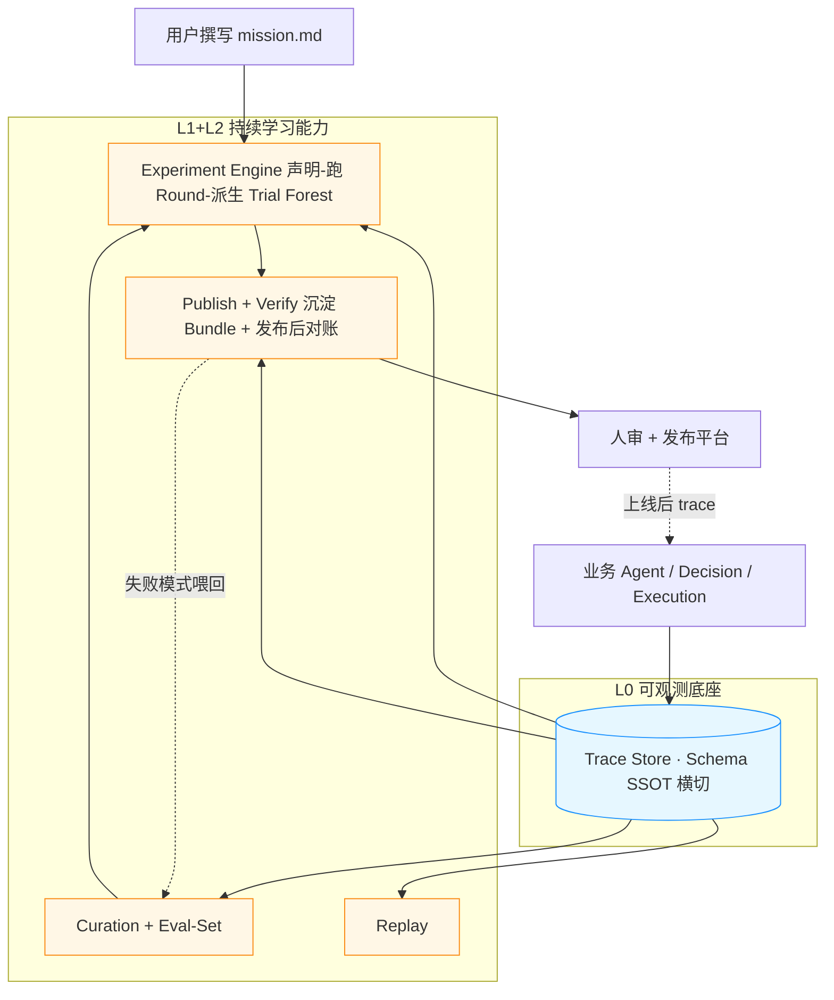
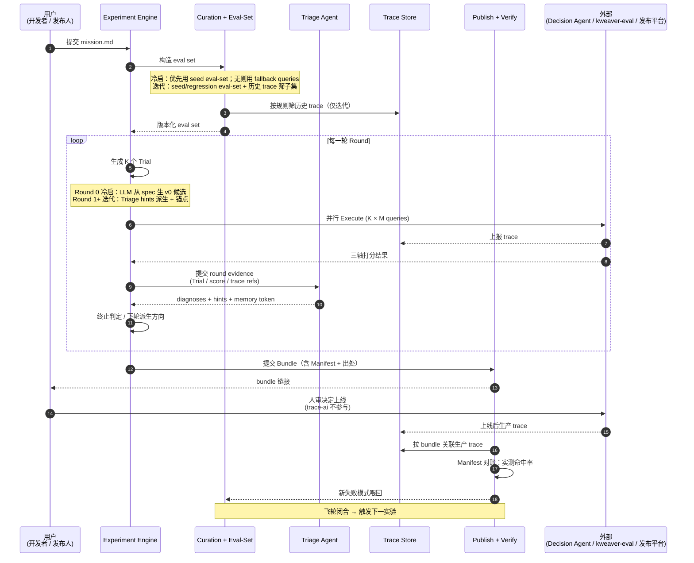
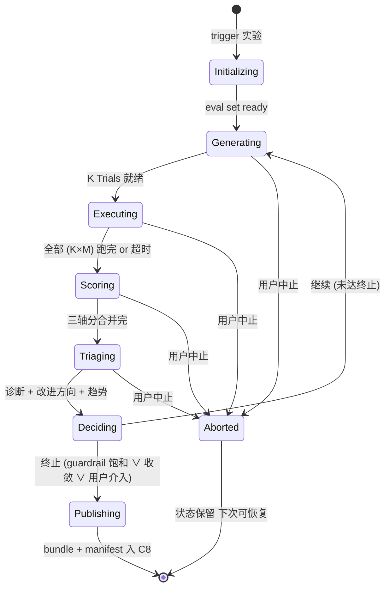

# trace-ai 持续学习中枢 Vision Spec

**Date:** 2026-05-07
**Status:** Draft
**Scope:** Vision-level（不锁 MVP，不替代各二级子模块自身后续 spec）
**Targets:** trace-ai 仓库整体重新立形 — 从"可观测系统"升级为"可观测 + 持续学习"双形态，覆盖 post-deployment agent engineering 的 L0 + L1 + L2 三层

---

## §1 背景

> **核心洞察 —— 智能体轨迹是企业最重要的数字资产之一。**
> 企业要执行的任务（**意图**）与企业的数字孪生资产（**现状** = BKN / Vega / Decision Agent / Execution Factory 资源）之间，永远存在**连接与裂缝**；Agent 轨迹（trace）是这两者交汇时**唯一的一手记录** —— 它既记录了每一次"意图 → 现状 → 执行 → 结果"的完整事实链，也客观裁决了"哪些连接成立、哪些裂缝暴露"。把 trace 沉淀为可分析、可回放、可反驳的资产，就是把企业的提效与优化从经验依赖搬到数据驱动；这是 trace-ai 一切设计的**思想根**，也是 §3.1 四轴业务目标（可追溯 / 可解释 / 可实验 / 可迭代）的共同前提。

**愿景（终态画像）**：trace-ai 的终态不是"更好的可观测平台"，而是把上述"连接与裂缝"沉淀为**可被实验、可被进化的资产层** —— 基于轨迹做并行实验与自动优化，去解决传统知识体系下结构性无解的三类问题：

- **隐形知识沉淀（Tacit Knowledge Harvesting）**：企业里大量"为什么这样做"的领域经验藏在人脑、口口相传的实践、零散文档里 —— 手工 KG / 文档库永远追不上业务实际。trace 是 Agent 撞上这些知识盲点时的客观一手记录；triage + hindsight relabel 让这些隐形知识反向沉淀为显式资产（BKN 节点 / Skill 文档 / Decision Agent 提示 / 偏好对）。
- **本体漂移（Ontology Drift）**：BKN 的 schema / 实体定义 / 关系定义会随业务演化而失真，Agent 用过期本体推理会出错；传统靠人定期 review 永远滞后且粗。trace 记录了每次实际访问的实体 / 关系 / 字段 —— 对照 BKN 现状即可自动发现漂移点、给出修正候选，让本体跟随业务呼吸。
- **智能体自动调优（Agent Auto-tuning）**：(BKN × Decision Agent × Execution Factory 资源 × 配置) 组合空间爆炸，靠人手工调校无法扩展。trace + experiment + triage 让"哪种配置在哪类任务上更优"成为可声明、可实验、可回放、可反驳的工程命题，把"配置工程师靠直觉调 Agent"压缩为"业务专家声明 goal"。

终态形态下，用户只需声明 **goal + guardrail + 可用资源池**（+ 冷启时的参考资料），trace-ai 自动展开 Trial 配置组合 → 多轮并行实验 + 三轴打分 + triage → 圈定**最佳 Trial 的资源选择 + 参数快照**（沿用 §2.2 Bundle 定义），freeze 为 bundle（自带 falsifiable manifest 与出处证据），交人审决定上线。bundle 同时覆盖**冷启**（Round 0 由 LLM 从 spec 直接生成 v0 候选 —— BKN 实体类型 / Skill 选型 / Agent 模板）和**迭代**（Round 1+ 在已注册候选间 categorical 选型，见 §5.1 思想 5）两态 —— mission.md 是 trace-ai **构建与演进 Agent 系统的唯一入口**（见 §3 G3）。本 spec 是这个终态的**第一公里** —— 先把 L0+L1+L2 工程闭环立住（详见 §1.4 范围），让飞轮可以转起来；**自动化**的隐形知识沉淀触发、本体漂移自动修复、跨实验的元学习等更前沿的产物，会在闭环跑通后逐步浮现。

### 1.1 现状

**KWeaver 平台栈**：BKN 承载企业知识网络（实体 / 关系 / 事件 / 数据视图）、Vega 提供异构数据虚拟化、Decision Agent 负责任务推理与编排、Execution Factory 负责动作执行环境（Skill 是被 Execution Factory 管理的一类资源）。`trace-ai` 一期围绕 OpenTelemetry 建成了 AI 系统的可观测底座 —— OTel Collector 接入、OpenSearch 存储、`agent-observability` 提供 trace 查询接口，跑通了"埋点 — 采集 — 存储 — 查询"端到端最小路径。

**行业研究底盘**：post-deployment agent engineering 已稳态形成四层工程栈：

| 层 | 关注 | 代表方法（KWeaver triage 索引） |
|---|---|---|
| **L0 Observability Infrastructure** | 结构化轨迹 schema、低成本采样 | AgentTrace、Breaking the Observability Tax |
| **L1 Signal Triage** | 在轨迹上找出"高复盘价值"子集 | Signals、AgentSeer、Trajectory Guard、Sentinel/PhantomPolicy、Near-Miss |
| **L2 Data Reconstruction / Relabeling** | 把 triage 出的轨迹转化为可消费偏好数据 | AgentHER（hindsight relabel）、TSR |
| **L3 Model Alignment** | DPO / RLHF 私有模型微调 | （远期，依赖私有模型，**不在 trace-ai 范围**） |

trace-ai 当前**只完成了 L0 的一半**（schema 不充分），L1 / L2 几乎空白。

### 1.2 问题

把上面的研究底盘对照 trace-ai 当前状态，五个真实痛点显形：

1. **数据沉默 — trace 没有反向驱动系统演进**。轨迹当前是"事后排障凭证"，平时静静躺在 OpenSearch 里。一个 (BKN, Decision Agent, Execution Factory 资源) 组合是好是坏，工程师靠直觉与零散日志判断，没有可声明、可复现、可比较的实验机制。L1 的 Signal Triage、L2 的 Data Flywheel 完全缺位。

2. **Schema 是沉默的封顶器（silent gating constraint）**。AgentTrace、Sentinel、Near-Miss 等方法都强依赖 trace schema 中**完整保留每次 tool call 的 name / args / return / scope / source** —— 任意字段缺失，下游方法立即不可用（Sentinel 实测：scope 标注缺失即让 Coverage recall 从 100% 跌到 40%）。trace-ai 当前 schema 仅保 OTel 默认字段 + `agent.*` 扩展，**对 L1/L2 准入是不充分的**。

3. **生产 trace 与评测体系割裂**。production 中暴露的 hard cases 不会自动沉淀为 eval set；evolve 阶段用什么数据、为什么用、当时表现如何 —— 链路断裂。AgentHER 路线（失败 trace → DPO 偏好数据）在当前 trace-ai 上没有落点。

4. **"为什么变更"无证据链**。一个 Agent 配置从 v1 演到 v2，**理由 / 候选 / 评分 / 选型路径**散落在聊天记录与 PR 评论里。AHE 的核心教训 —— auto-fix loops 必须自带 falsifiable change manifest（predicted_fixes / risk_tasks / 文件级回滚）—— 在 KWeaver 当前没有任何对应物。

5. **观测税（Observability Tax）失控的潜在风险**。Agent 链路从单轮问答演进到多步骤自治执行，trace 量爆炸式增长。trace-ai 当前没有拓扑感知采样、没有动态阈值触发，全量采集随规模增长会撑爆 OpenSearch 写入与查询成本。

### 1.3 触发

- **KWeaver 把"企业数字孪生"作为定位**，意味着每一次 Agent 在生产中的执行都是数字孪生的一次"实验记录"。继续把 trace 当作仪表盘上的指针，会浪费这份基础设施最大的杠杆。
- **Agent 形态从单轮问答演进到多步骤自治执行**，(BKN × Decision Agent × Execution Factory 资源 × 配置) 组合空间爆炸式增长，**靠人手工调校已无法扩展** —— 必须让 trace 数据反过来驱动 Agent 系统的持续学习。
- **行业研究已经把 4 层栈各自的方法论与立场分歧都摸清了**（详见 `research-agent-triage/notes/00_research_landscape.md` 与各论文笔记）。trace-ai 完整接入 L0+L1+L2 的工程窗口已经成熟，再不动手就是把先发优势让给社区。

### 1.4 范围

本 spec 描绘 trace-ai 在 KWeaver 数字孪生愿景下的整体形态：

- **覆盖范围 = L0 + L1 + L2**：trace-ai 是 post-deployment agent engineering 在 KWeaver 上的**三层一体**承接者。
  - L0 → trace-ai 的"可观测"顶层能力（采集 / 存储 / 查询 / schema 治理）
  - L1+L2 → trace-ai 的"持续学习"顶层能力（信号分诊 / 数据飞轮 / 实验循环 / 重放 / 发布资产 / 发布后验证）
- **不在范围**：L3 模型对齐 / 私有模型微调依赖企业自有模型与训练资源，本 spec 不涉及；trace-ai 仅产出可被 L3 消费的偏好数据资产。
- **vision-level**：每个二级子模块的具体落地由其自身后续 spec 承接。

---

## §2 概念模型

先压缩排列各类名词便于回查（§2.1），再单独画出实验循环的基本模型（§2.2）。

### §2.1 名词解释

#### 平台与协议

| 术语 | 含义 |
|---|---|
| BKN | KWeaver 的企业知识网络（实体 / 关系 / 事件 / 数据视图） |
| Vega | KWeaver 的数据虚拟化层，统一 SQL 接入异构数据源 |
| Decision Agent | KWeaver 中负责任务推理与编排的 Agent 资源 |
| Execution Factory | 动作执行环境，管理 Skill / API / 数据视图等资源 |
| Skill | Execution Factory 管理的可复用动作资源 |
| OTel / OTLP | OpenTelemetry 与其传输协议（gRPC / HTTP） |
| OTel Collector | 接收 — 处理 — 导出的开源遥测组件 |
| Trace / Span | OTel 数据结构：一次执行 → Span 集合 |
| ss4o | OpenSearch Simple Schema for Observability，trace-ai 默认入库 schema |

#### 工程栈层级（贯穿 §3 §6 §7）

| 层 | 含义 |
|---|---|
| **L0 可观测** | 结构化轨迹 schema + 采集 / 存储 / 查询底座 |
| **L1 信号分诊** | 在轨迹流上低成本筛"高复盘价值"子集 |
| **L2 数据重构 / 重打标** | 把 L1 筛出的轨迹转为偏好数据 / 实验数据 |
| **L3 模型对齐** | 私有模型 DPO / RLHF 微调（**不在 trace-ai 范围**） |

> 这是按"trace → 偏好数据"的研究流水线**纵切**；§6.1 图二另给一个按运行时角色的**横切**视图（元控制 / 研判 / 执行 / 观测），两者正交，互为参照。

#### 信号与轨迹

| 术语 | 含义 |
|---|---|
| Trajectory | 一次执行的 span 序列 + events + attributes |
| Signal | 轨迹上的判别特征（交互 / 执行 / 环境三层） |
| RO | 合规执行必须读取的事实集合；"应读未读"即 latent failure |
| Hindsight Relabel | 把失败轨迹重写为"原行为 vs 应有行为"偏好对 |
| Observability Tax | trace 量随链路膨胀的成本（需采样应对） |
| Falsifiable Manifest | 每次 Trial 改动自带"预测修哪些 / 风险哪些"，可机器对账 |

#### trace-ai 子模块速查（详见 §7）

trace-ai 分两大顶层能力，下设 9 个二级子模块（3 已存 / 6 待建）+ 1 横切。

| 子模块 | 一句话职责 |
|---|---|
| M1 otelcol / M2 OpenSearch / M3 agent-observability | L0 可观测三件套（M1 M2 已存在） |
| M4 Curation | 在 trace 流筛高复盘价值子集 |
| M5 Eval-Set Builder | 构造可复现 eval 集（含 / 不含 reference 两态） |
| M6 Experiment Engine | 实验循环本体（Generate / Execute / Score / Triage） |
| M7 Replay | 历史 trace 用新 Trial 重跑 |
| M8 Publish Registry | bundle + manifest 资产沉淀，仅产出不上线 |
| M9 Post-deploy Verify | 发布后 manifest 对账，新失败模式喂回 M4 |
| MX1 Schema | 跨 9 个子模块共享的契约（横切；静态契约 + CLI 校验器） |

### §2.2 基本模型

> 实验循环的骨架：**mission.md**（声明）→ 触发 N 个 **Round**（执行批次）→ 每个 Round 跑 K 个 **Trial**（配置实例）；Trial 之间通过 lineage 形成 **Forest**；终态产出 **Bundle**（自带 **Falsifiable Manifest**），交人审决定上线。

| 概念 | 含义 |
|---|---|
| **mission.md** | 用户撰写的 markdown 声明：goal / guardrail / 资源池 / Variation Points / eval-set 引用 / fallback queries。运行它的引擎称 Experiment Engine（见 §7.M6） |
| **Eval Set** | 可复现评测集，既可以由用户在冷启前提供，也可以由 M5 从生产 trace / curation 产物构造；Experiment Engine 执行时统一展平成 eval cases |
| **Variation Point** | 实验声明里"可被搜索的轴"；本 spec 限定为 categorical |
| **Trial** | 一次实验的"配置实例" —— 一组具体 variation 取值 + lineage（指向 parent Trial）。静态、不可变、可被多个 Round 包含 |
| **Trial Forest** | Trial 的派生关系图。每个 Trial 至多 1 个 parent，整体是多根森林（不是一般 DAG） |
| **Round** | runtime 的一次批次：K 个 Trial 并行跑 → 三轴打分 → Triage 诊断 → 决策。Trial × Round 是 M:N |
| **Triage Agent** | 轮后"循环大脑"：诊断 + 给改进方向 + 跨轮持记忆。下文 "Triage" 一词专指此组件 |
| **三轴打分** | Outcome / Trajectory / Guardrail 三轴独立给分后合并 |
| **Guardrail 双轨** | safety = hard gate（违反即淘汰）；quality = penalty（违反即扣分） |
| **Bundle** | 实验终态产物：最佳 Trial 的资源选择 + 参数快照 + Falsifiable Manifest + 出处证据 |

---

## §3 设计目标与非目标

### 3.1 业务目标

trace-ai 的业务目标围绕 **可追溯 / 可解释 / 可实验 / 可迭代** 四轴展开 —— 四轴构成因果链：先有可信的**调用链**，才能撑起可问责的**证据链**；有了证据链，才能落地可声明的**实验循环**；实验循环跑通，系统才具备 trace 反向驱动配置生成的**迭代闭环**。

**G1 — 可追溯（调用链）。**
任何 Agent 执行中的关键决策、工具调用、知识检索（BKN）、数据访问（Vega）、状态转移，都必须在 trace-ai 上有**结构化、可被消费、可被审计**的留痕。schema 是 silent gating constraint —— trace-ai 是 KWeaver 数字孪生的"调用链底座"，地基不牢则上层全废。

**G2 — 可解释（证据链）。**
每一次系统变更（Trial 选型、bundle 发布、模块迭代）都自带 **falsifiable change manifest**（"预测会修复哪些 query / 风险哪些 query"）+ **出处证据**（哪些 trace / 哪一轮 / 哪份 triage 报告支持这个决策）。为什么从 v1 演到 v2 —— 全部以可机器判决、可人工审计、可回滚的形式沉淀在 publish registry。

**G3 — 可实验（声明驱动）。**
`mission.md`（goal / guardrail 双轨 / 资源池 / 可变点 / eval-set 引用 / fallback queries / 冷启参考资料）是 trace-ai **构建与演进 Agent 系统的唯一入口**：**冷启**走 Round 0（优先使用用户引用的 seed eval-set；若无 eval-set，则从 mission.md 的 fallback queries 生成最小 eval set；LLM 从 spec 直接生成 K 个 v0 候选 —— BKN 实体类型 / Skill 选型 / Agent 模板 / prompt），**迭代**走 Round 1+（在 Triage hints 下派生 Trial）。两态共用同一引擎与 bundle + manifest 资产链路；任何一轮都可在另一台机器复现。绕过 mission.md 直接去 console 拼 BKN / Skill / Agent 是反模式 —— 没有 manifest 即没有可问责的证据链。

**G4 — 可迭代（trace → 配置生成飞轮）。**
系统基于实验结果与轨迹自动做 triage 分析，产出下一轮的 Trial / Skill 选择 / BKN 拓扑 / Decision Agent 模板等**优化配置建议**；发布后的生产 trace 又自动回流 curation，形成 "trace → 分诊 → 配置生成 → 实验 → 发布 → trace" 的飞轮闭环。trace 不再只是事后排障凭证，而是数字孪生的实验台账。

### 3.2 技术目标

§3.1 的四条业务目标在技术上落地到三轴：**可追溯** 主要由 T1 可观测承接（schema + 关键调用全覆盖）；**可解释** 贯穿 T1（trace 即一手证据）与 T3 闭环进化（manifest + 对账）；**可实验** 与 **可迭代** 由 T2 可分析（信号分诊 + 多维查询）和 T3 闭环进化（实验声明驱动 + 飞轮闭合）共同支撑。

trace-ai 的技术目标围绕三轴展开：**可观测 → 可分析 → 闭环进化**。三者层层递进 —— 可观测是地基（L0），可分析是杠杆（L1），闭环进化是产物（L2）。每一轴一个命题 + 若干可衡量子目标。

#### T1 — 可观测（Observable）

> **命题**：任何 Agent 执行中的关键决策、工具调用、知识检索、数据访问、状态转移，都必须在 trace-ai 上有**结构化、可被消费、可被审计**的留痕 —— schema 是 silent gating constraint，地基不牢则上层全废。

**子目标**：

- **T1.1 Schema 即 SSOT**：trace schema 以 YAML/JSON Schema 形式版本化、可校验、可回溯；字段缺失自动标 `partial_trace` + 触发 `schema_validation_failed`，**绝不静默丢数**。
- **T1.2 关键调用全覆盖**：Decision Agent 的推理步骤、Execution Factory 的资源调用（含 Skill / API / 外部工具）、BKN 检索、Vega 数据查询，每一类都有约定语义属性（`gen_ai.*` + `agent.*`），不靠开发者凭直觉打 tag。
- **T1.3 观测税可控**：拓扑感知采样 + 错误链路全量保留 + 成功链路尾采样 + 大字段摘要化（prompt / response / retrieval 正文不进索引体），保证 trace 量随 Agent 链路深度的增长不撑爆存储。
- **T1.4 自观测闭合**：trace-ai 自身 9 个子模块（M1–M9）全部上 OTel 埋点、trace 喂回自己——循环本身可被排障、可被时间旅行（理由见 §5.1 思想 4）。

#### T2 — 可分析（Analyzable）

> **命题**：原始 trace 流必须能在**低成本**下被加工出"高复盘价值子集"与"可消费的诊断结论" —— 粗筛默认走 rule-based / 状态机 / 声明式不变量，把 LLM-judge 留给小子集与深度任务。"采样信息量"和"判断准确性"是两件事，不能用一种工具把它们都抓了。

**子目标**：

- **T2.1 多维查询任意组合**：trace 可按 `trace_id` / `experiment_id` / `trial_id` / `round` / `conversation_id` / `agent_id` / `tool_name` / 时间窗 / `agent.trace.type` 任意组合检索 + 聚合；查询契约稳定，UI / 排障 / 实验引擎共用一套。
- **T2.2 轻量信号优先**：L1 分诊默认 rule-based 探针 + 状态机 + 声明式 KG 不变量；LLM-judge 限定在 triage 出的小子集与 hindsight relabel（理由见 §5.1 思想 1）。
- **T2.3 规则与诊断可审计、可驳回**：每一条 triage 规则、每一份诊断报告都可被列出、被审视、被人工驳回；Triage Agent 的每次诊断附带"我读了哪些 trace、用了哪些规则、跳过了什么"，本身可被回看（即 T1.4 的延伸）。
- **T2.4 分析延迟可工程化**：在 N=10k 量级 trace 上完成一次 round 的全量分诊与三轴打分，wall-clock ≤ 数分钟（具体阈值由各子模块自身 spec 锁定）。

#### T3 — 闭环进化（Closed-loop Evolution）

> **命题**：trace 数据必须能驱动 (BKN, Vega, Decision Agent, Execution Factory) 组合的**可声明、可复现、可审计**的自动迭代；每一次系统变更自带"预测 — 验证 — 回退"的证据链。**自审是循环可信的前提**，没有 self-audit 的 auto-fix loop 是 thesis 明确反对的反模式。

**子目标**：

- **T3.1 实验声明驱动**：mission.md（含 goal / guardrail 双轨 / 资源池 / 可变点 / eval-set 引用 / fallback queries）走 git 管理；多轮迭代 → bundle 资产链路端到端可被 review，**任何一轮都可在另一台机器复现**。
- **T3.2 自带 falsifiable manifest**：每个新 Trial / 新 bundle 必须给出"预测会修复哪些 query / 风险哪些 query"，下一轮机器判决并回写"预测命中率" —— 这是抗 self-deception 的核心机制（参考 AHE：fix-prediction 5× / regression-prediction 2× random）。
- **T3.3 资产沉淀化**：实验过程（每轮的 Trial 集 / 三轴评分 / triage 报告）、选型证据（哪些 trace 支持哪个判断）、发布资产（bundle）、验证结果（manifest 对账）全部进 publish registry，可机器查询、可人工审计。
- **T3.4 闭环重入生产**：发布后生产 trace 自动喂回 verify 子模块，对照 bundle 自带的 manifest 给出"实测命中率 / 回退建议"；这次验证本身又是新一轮 curation 的输入 —— **飞轮闭合**。

#### 3.2 之外的支撑性约束

下列工程约束不是技术目标的"主轴"，而是支撑这三轴落地的边界：放到 §9 边界考虑里详细写，§3 这里只点名。物理形态约束分两类（详见 §6.4）：

- **服务面（M1 / M2 / M3）**：高可用 / 无状态横向扩展（K8s Deployment / StatefulSet）；写入 / 查询 SLA（沿用一期 PRD：trace 详情 P95 ≤ 2s、5 分钟可查询率 ≥ 95%、查询服务 SLA ≥ 99.9%）
- **CLI 面（M4 / M5 / M6 / M7 / M8-submit）**：单 binary 多子命令；状态走 git 不依赖中央 RDB；driver 失败靠 portable folder + `kweaver trace exp resume` 续跑
- 模块边界与契约稳定（每个 M-spec 独立演进；CLI 子命令语义版本化；服务面 API 走 `/api/<module>/v1/...` 版本化）
- 国产化适配（HCE / openEuler / dm8 / MariaDB）
- 可部署、可灰度：服务面走 Helm + feature flag；CLI 走二进制版本管理（每条命令对自己的 flag / 行为 SemVer）

### 3.3 非目标

**N1 — 不做 L3 模型对齐 / 私有模型微调。**
trace-ai 仅产出"可被 L3 消费的偏好数据资产"（hindsight-relabeled pairs / preference dataset），不做 DPO / RLHF / SFT。微调依赖企业自有模型与训练资源，是独立工程。

**N2 — 不建设完整可视化 observability 产品。**
trace-ai 只对外暴露查询接口与统一数据模型，UI 由 KWeaver 上层产品（dataflow、agent factory 等）承接调用。不复刻 Datadog / Grafana 的视图能力。

**N3 — 不做发布执行 / 在线实验平台。**
publish registry 只产出可复现的 bundle 资产，搭配 falsifiable manifest 与出处证据，"是否上线、怎么切流、何时回滚"由人或独立的发布平台决定。具体地：trace-ai **不负责** A/B 实验设计、流量分配、在线对照组管理、金丝雀 / 灰度策略、回滚执行 —— 这些是发布平台 / 实验平台的职责。trace-ai 仅观测发布后的真实 trace 与 manifest 对账（这是 verify 子模块的职责），且对外部平台用什么策略分流不感知、不依赖。

> **唯一的反向耦合点 —— `deployed_at` 时间戳**：M9 Post-deploy Verify 需要知道 bundle 的上线时间以触发"上线后 1h / 24h / 1w / 1m"对账 cadence。约定由人审 / 发布平台在上线动作完成后**回写一个 `deployed_at` 时间戳到 publish-registry 内对应 bundle 的目录**（git commit 即可）。这是观测窗口的锚点，不是控制权——trace-ai 既不持有发布密钥也不能撤销上线，仍与 N3 主旨一致。

**N4 — 不替代 kweaver-eval。**
实验循环的 Score 阶段把 `kweaver-eval` 作为"评分函数原语"调用，复用其双轨打分（deterministic + agent judge）与 severity 分级，不重建评测体系。

**N5 — 不做通用 AutoML / 超参优化框架。**
variation 在**迭代场景**限定为 categorical（"choose-one-from-set"），不支持连续超参 / 组合约束 DSL / 通用 generator 函数；冷启 Round 0 是**唯一**启用 LLM-generative variation 的窗口（详见 §5.1 思想 5）。

**N6 — 不绑定单一存储产品。**
一期主路径走 OpenSearch + ss4o，但所有跨子模块的契约都以"逻辑 schema + 查询接口"为锚，不以"OpenSearch DSL"为锚。后续可平滑切换到 ClickHouse / 自研引擎。

**N7 — 一期不建独立的权限中心 / RBAC / 字段级访问控制 / 审计日志。**
按平台总体安全方案承接。trace-ai 子模块的 API 只承诺正确性与可观测性。

### 3.4 成功判据（vision-level，不锁 SLO）

| 维度 | "在路上"的指征 |
|---|---|
| 闭环跑通 | 一份完整的 mission.md → 多轮迭代 → 产出 bundle + manifest → 发布后 verify 给出"预测命中率"；首条端到端走完即视为里程碑 |
| Schema 健康度 | 拆成两条独立指标：(a) **覆盖率** —— 全量 trace 中关键字段（tool name/args/return/scope/source/latency/status）非空率 ≥ 95%；(b) **schema 校验漏检率** —— 未被标 `partial_trace` 但实际字段缺失的比例 ≤ 1%（即非 partial_trace 内部接近 100%）。两条联立才能避免"覆盖率达标但其实是漏检高"的伪健康。不合规即标 `partial_trace` + 触发 `schema_validation_failed` 事件（与 §9.2 "绝不丢数" 一致）|
| Triage 信噪比 | curation 输出的"高复盘价值子集"在二次人工抽样验证下 informativeness 不低于行业 baseline（Signals 论文 ~82%）|
| Trial Forest 进入决策 | 单次实验的 Triage 报告同时出现三类分 —— "派生 delta / 探索绝对 / 锚点 cross-round delta"（落实 §5.1 思想 6 / §5.2 D6 + D7 / §2.2 基本模型）；存在至少一例"沿派生链改某轴 → 连续两轮提分"的可回看因果链 |
| Manifest 可信度 | publish registry 中每个 bundle 的 manifest，post-deploy verify 阶段实测命中率显著高于随机（参考 AHE：fix-prediction 5× / regression-prediction 2×）|
| 模块独立性 | 任意二级子模块的实现可被替换为 mock 或新版本，整体闭环不破 —— 通过契约测试验证 |
| 观测税 | 单 query 的 trace 量在采样后保持可控；具体阈值由 L0 子模块自身 spec 定 |

---

## §4 能力与功能设计

trace-ai 整体提供 **9 项二级子能力**，分布在两大顶层能力（可观测 / 持续学习）之下。每项给出：命题、输入、输出、关键功能点、依赖。本节只到"能力"层，模块物理实现见 §7。

### §4.1 可观测能力（落实 L0）

#### C1 数据接入（Ingestion）

> **命题**：让任意 KWeaver 内 / 外的 Agent 应用都能以**零侵入或低侵入**的方式把执行轨迹送进 trace-ai。

- **输入**：业务侧 OTel SDK 上报的 OTLP 数据（trace / log / metric）
- **输出**：经基础增强后的结构化 trace 文档，写入 Trace Store
- **关键功能点**：
  - OTLP gRPC (4317) / HTTP (4318) 双协议接入
  - 基础增强：注入 service / tenant / 环境元数据；字段别名兼容
  - 拓扑感知采样：错误链路 100% 保留，成功链路按租户 / Agent / 流量尾采样
  - Memory limiter + batch processor 防突发流量打挂
  - 大字段裁剪（prompt / response / retrieval 正文摘要 + 哈希）

#### C2 数据存储（Trace Store）

> **命题**：保证 trace 落得下、查得回、不撑爆。

- **输入**：来自 C1 的结构化 trace 文档
- **输出**：按信号类型 + 日期切分的索引集合，可被 C3 / 持续学习层各能力消费
- **关键功能点**：
  - 一期 OpenSearch + ss4o schema 主路径，但内部跨能力契约**不绑 OpenSearch DSL**（保 ClickHouse / 自研引擎可替换性）
  - 高频过滤字段建 keyword 索引（trace_id / agent_id / conversation_id / experiment_id / trial_id / agent.trace.type / tool_name / status）
  - 保留周期、索引前缀、分片策略全部可配置
  - 故障降级：部分索引不可用时，明细查询仍可用，聚合允许降级

#### C3 数据查询（agent-observability）

> **命题**：对**所有上层能力** —— UI、排障工具、实验循环、replay、verify —— 提供唯一的 trace 查询入口。

- **输入**：HTTP 查询请求（结构化条件 / 受控 DSL / 按 ID 取详情）
- **输出**：统一格式的 trace / span / event 集合
- **关键功能点**：
  - 多维查询：trace_id / experiment_id / trial_id / round / conversation_id / agent_id / tool / 时间窗任意组合
  - 高频便捷接口（按 conversation 取所有 span / 按 trace_id 取详情）
  - 通用受控 DSL（裹好的 OpenSearch DSL 入口，带租户隔离与查询配额）
  - 查询超时统一 504、schema 不一致返回 partial_trace 标记不丢数
  - Swagger 自动生成、对外文档与代码同步

#### X1（横切）Schema SSOT + 校验器

> **命题**：schema 是 silent gating constraint，必须作为 SSOT 跨 9 个子能力共享。

- **输入**：schema 版本声明 + 字段约束
- **输出**：跨子模块共享的契约文档 + 自动校验器
- **关键功能点**：
  - 一份版本化（`schema_version`）的 trace schema 定义文件，归 trace-ai 仓库根管理
  - 校验器双轨：M1 inline 校验（标 partial_trace + 触发 schema_validation_failed event）+ `kweaver trace schema audit` CI 周期 audit（跨 span 不变量 / 漂移率 / 准入率，详见 §7.MX1）
  - 字段别名兼容（如 `session_id → agent.session.id`），兼容表也版本化
  - 必填字段清单（针对 L1/L2 准入）：tool name/args/return/scope/source/latency/status；缺失即告警

### §4.2 持续学习能力（落实 L1 + L2）

#### C4 信号分诊（Curation）

> **命题**：在生产 trace 流上以**低成本**筛出"高复盘价值子集" —— 失败链路、慢链路、latent failure（绕过 RO 的成功链路）、规则违反、新模式异常等。

- **输入**：来自 C3 的 trace 流（可按时间窗 / 租户 / Agent 维度拉取）
- **输出**：高复盘价值的 trace 子集 + 每条 trace 的"为什么进入子集"标签集合
- **关键功能点**：
  - 三层信号探针（Signals 风格）：交互层（用户语义异常）/ 执行层（步骤异常 / 工具失败模式）/ 环境层（KG 不变量违反）
  - 声明式不变量（Sentinel / PhantomPolicy 风格）：在 BKN 上声明"若 X 则必读 Y / 必写 Z"，违反入子集
  - Latent failure 检测（Near-Miss 风格）：guard-code-as-oracle 反查"应读未读的 RO"，在成功 trace 中找隐性失败
  - 拓扑异常（AgentSeer 风格）：把 trace 视为 action-component graph，检测拓扑层异常
  - 规则可解释、可驳回、可版本化（每条规则有 `rule_id` + `rule_version`，对应一份 yaml）
  - 不默认调 LLM；LLM-judge 留给后续 hindsight relabel 阶段

#### C5 评测集构造（Eval-Set Builder）

> **命题**：把用户已有的请求/标准答案、mission fallback queries、C4 的 trace 子集整合成**可复现、可版本化、可对比**的 eval 集。

- **输入**：用户在 mission.md 中引用的 eval-set、mission fallback queries、C4 输出的子集
- **输出**：版本化的 eval set 文档（含 query / 可选 reference / source / weight / labels）
- **关键功能点**：
  - 两态支持：query 带 reference（可走 deterministic 打分）/ 不带 reference（走三轴打分中的 outcome+trajectory 组合）
  - 来自 trace 圈选：UI / DSL 圈出 N 条历史 query，自动脱敏后入 eval set
  - 来自 hindsight relabel：把 latent failure 的"原行为 vs 应有行为"沉淀为偏好对（AgentHER 风格），是 L3 的天然原料
  - eval set 走 git 管理、可 diff、可 review；用户可预置，也可由 M5 生成；版本化后被 experiment engine 引用

#### C6 实验循环（Experiment Engine）

> **命题**：让一份 mission.md 自动跑出最佳 Trial + 可信证据链。

- **输入**：mission.md（goal / guardrail 双轨 / 资源池 / 可变点 / eval-set 引用 / fallback queries）+ C5 提供或校验后的 eval set
- **输出**：每轮的 Trial 集合 / 三轴评分 / triage 报告 + 终结轮的最佳 Trial（→ C8）
- **关键功能点**：
  - 4 阶段流水线 + Coordinator FSM：Generate → Execute → Score → Triage（详见 §7）
  - Generate：读 variation 声明 + triage hints 产出本轮 K 个 Trial（含派生 Trial 与重跑锚点 Trial）
  - Execute：调度到 Decision Agent / Execution Factory，K Trial × M query 并行
  - Score：复用 kweaver-eval（双轨打分 + severity）+ trace 三轴合成（Outcome / Trajectory / Guardrail）；输出双类分 —— 派生 Trial 的相对父辈 delta + 探索/锚点 Trial 的绝对分（落实思想 6）
  - Triage Agent：诊断 + 改进方向 + 探索/利用趋势信号 + 跨轮记忆；兼有全局视野 + 沿父子链局部对比双模式
  - Guardrail 双轨：safety = hard gate（淘汰）/ quality = penalty（扣分）
  - 终止：guardrail 饱和 ∨ 收敛 ∨ 用户介入
  - 全程产 OTel trace 喂回 trace-ai 自己
  - Trial Forest / 派生评分 / 锚点机制 / 探索-利用分层：见 §5.1 思想 6 + 思想 7、§5.2 D6 + D7、§7.M6

#### C7 轨迹重放（Replay）

> **命题**：拿一条历史 trace（生产或 eval set）用一个新 Trial 重跑，回答"如果当时是这个配置会怎样"。

- **输入**：trace_id 或 (experiment_id, query) 元组 + 待评估 Trial
- **输出**：新 trace + 与原 trace 的逐 span 对比（步骤数 / 工具选择 / 检索命中 / 最终输出 / 三轴评分对比）
- **关键功能点**：
  - 仅按"输入面"重放：原始 user query + 上下文 + 工具响应可被 mock（成本可控）
  - 严格模式 / 对比模式 / 探索模式三档（用户可选）
  - 重放本身产 trace 喂回 trace-ai，并标 `replay_of=<原 trace_id>`
  - 是 verify 子能力的可选输入；也是排障工程师的"假设性问题"工具

#### C8 发布资产（Publish Registry）

> **命题**：把"最佳 Trial"沉淀为可复现、自带 manifest 的 bundle 资产；trace-ai 仅产出，不上线。

- **输入**：来自 C6 的最佳 Trial + 整轮实验的元数据
- **输出**：bundle 资产（资源选择 + 参数快照 + falsifiable change manifest + 出处证据）
- **关键功能点**：
  - bundle 内容：BKN / Vega / Decision Agent 模板 / Execution Factory 资源选择 + 各自的版本快照 + 实验 ID + 选型轮次
  - falsifiable change manifest：声明"预测会修复哪些 query / 风险哪些 query / 关键边界条件"
  - 出处证据：哪些 trace、哪些 round、哪些 triage 报告支持这个 Trial
  - 版本化：每个 bundle 有唯一 ID + 校验和；可被 git 引用、可被 PR review
  - 不触发上线：bundle 仅作为"资产"产出，发布动作由人或独立平台承接

#### C9 发布后验证（Post-deploy Verify）

> **命题**：bundle 上线后，自动监控生产 trace，把"实测表现"对照 bundle 自带的 manifest 进行机器对账。**C9 是被动观测式对账，不是在线实验执行器** —— 不分配流量、不管理对照组、不执行回滚；产出的"回退建议"是给人/发布平台的输入，trace-ai 自己不动手。

- **输入**：已上线的 bundle ID + 上线后一段时间窗的生产 trace
- **输出**：对账报告（manifest 命中率 / 偏离指标 / 回退建议）+ 失败案例自动喂回 C4
- **关键功能点**：
  - manifest 中"预测会修复"的 query 模式 → 实测是否真修复
  - "预测风险"的 query 模式 → 实测是否真出问题
  - 生产 trace 中出现的新失败模式 → 自动入 C4 形成新一轮 curation 输入
  - 命中率显著低于阈值（参考 AHE：fix-prediction 5× random / regression-prediction 2× random）→ 给出回退建议
  - 验证报告归档进 publish registry，作为下次实验的输入证据

### §4.3 跨能力的数据流（preview，详见 §6）

```
生产 Agent ──产 trace──▶ C1 ──▶ C2 ──▶ C3
                                          │
                       ┌──────────────────┘
                       ▼
                       C4 ──▶ C5 ──▶ C6 ──▶ C8 ──▶（人审 + 上线）
                       ▲      ▲       │           │
                       │      │       ▼           ▼
                       │      │      C7 ──▶（排障 / verify input）
                       │      │                   │
                       │      └─────── C9 ◀─── 生产 trace
                       │                │
                       └──失败模式喂回──┘
```

闭环图最终态在 §6 给完整 mermaid。

---

## §5 设计思路与折衷

把 trace-ai 整体设计的"为什么这样做"拆成两层：上层是**主导思想**（不可妥协的设计立场，决定 trace-ai 的"性格"），下层是**关键折衷**（在等价路径中选了哪一条、放弃了什么）。

### §5.1 主导思想（5 条）

#### 思想 1 — 轻量信号优先，LLM-judge 留给小子集

"采样信息量"和"判断准确性"是两件事 —— 前者用规则 / 状态机 / 声明式不变量足够，把 LLM-judge 留给 triaged 后的小子集和深度任务。

**实证**：[13] AgentDebug 的 detector 强依赖 GPT-4.1，换 Llama-3.3-70B 后 All-Correct 从 32% 跌到 6% —— LLM-judge 在前线全量使用既贵、又脆、又不可解释。

**落地**：C4 信号分诊**默认不调 LLM**；LLM 只在 hindsight relabel（C5）、深度诊断（Triage Agent，C6）、Outcome 打分（C6 score 阶段、且只对 triaged 后的小子集）三处启用。

#### 思想 2 — 自审是循环可信的前提

任何 auto-fix loop 必须自带 falsifiable change manifest（"预测会修哪些 / 风险哪些"），下一轮机器判决并回写命中率。否则就是 thesis 明确反对的反模式。

**实证**：[12] AHE 显式量化 evolve agent 的 fix-prediction（5× random）和 regression-prediction（2× random）；[14] Autodata 同源方法但缺 self-audit，落入反模式。

**落地**：C8 publish registry **强制要求**每个 bundle 自带 manifest；C9 verify 子能力存在的全部理由就是为了机器对账这份 manifest。**没有 manifest 的 bundle 不允许进 registry。**

#### 思想 3 — 人保留可问责的闸门（Human-in-the-loop on Publish）

数字孪生的核心是"可被人审"，不是"完全自动化"。trace-ai 的循环可以一路自动到 bundle，但**上线动作必须保留人的决策**。

**落地**：C8 仅产出 bundle 资产、出处证据与 manifest；切流量 / 灰度 / 回滚都不在 trace-ai 内部。这是 N3 非目标的根因。

#### 思想 4 — 全闭环自观测

trace-ai 自己的每一个子能力都产 OTel trace 喂回自己 —— curation / experiment / replay / publish / verify 都是它自己的"用户"。

**落地**：让 trace-ai 在生产中**可排障、可时间旅行、可被自己分析**；这也是为什么循环失败时根因可被追溯（而不是黑盒）。

#### 思想 5 — Variation 默认 categorical，冷启 Round 0 启用 LLM-generative

**迭代场景（Round 1+）**：Variation 限 categorical（"choose-one-from-set"）—— 期望 80% 实验场景被覆盖；保留连续超参 / DSL / generator 函数会让搜索空间不可证、决策不可审、引入额外评测成本。

**冷启场景（Round 0）**：mission.md 没有可选项可选（系统还不存在），Generator 由 LLM 直接从 `goal + 参考资料 + 资源池 + seed eval-set / fallback queries` 生成 K 个 v0 候选（BKN 实体类型 / Skill 选型 / Agent 模板 / prompt）。这是**唯一允许 generative variation 的窗口**；Round 0 生成完即冻结进注册表，Round 1+ 退回 categorical（在已注册候选间选型）。

**落地**：mission.md 的 variation 语法在迭代场景封闭（categorical），在冷启场景由 Generator 把 spec 转成 K 个 categorical Trial（生成完即冻结）。**一开始就在迭代场景开放 generative 是工程灾难；只在冷启窗口允许是必要妥协。**

#### 思想 6 — 派生关系必须进入评分逻辑

如果 Trial 的 lineage（`parent_trial_id`）只用作元数据查询、不参与**评分与 Triage 决策**，则 Forest 派生退化为装饰 —— 跑了 N 轮后 Triage 只能看"谁绝对分高"，学不到"沿哪条派生链改某个轴持续提分"的因果信号，循环退化成 grid search。

**落地**：Trial 评分按角色区分**三条赛道**（safety guardrail 作为 hard gate **横切三者**，违反即淘汰，与本节正交）：

- **派生 Trial → 沿父子链 delta**：看 `score(child) − score(parent)`，不看绝对分；回答"这次派生改了哪个轴、效果是涨还是跌"
- **探索 Trial → 跨派生链绝对**：与当前最佳直接 PK 的绝对分；回答"新种子是否值得开树"
- **锚点 Trial → 跨 Round 自身 delta**：同一 Trial 在新 Round 重跑，对的是"自身 × 时间"的分差（D7 落地）；回答"评分尺度本身是否漂了"

具体何时切换、阈值多少 —— 由 M6 内部 spec 自决，不锁在本文档。本思想承诺"lineage 必须进评分 + 三类角色各有自己的评分语义"，不承诺具体算法。

#### 思想 7 — 探索-利用决策分层化，不引入全局优化器

经典 AutoML 的探索/利用平衡（UCB / Thompson sampling / MCTS / GP surrogate）对一个声明驱动、轮数有限、目标偏向"理解为什么"的实验循环是 over-engineering —— 跟 §3.3 N5（不做通用 AutoML）一脉相承。

**落地**：探索-利用分 4 层处理，每层只管自己尺度：

| 层 | 决策者 | 关心的事 |
|---|---|---|
| Round 内 | Triage hint + Generator | 本轮派生哪几条、留几个 wild card slot |
| 跨 Round | Triage Agent | 继续深耕同一棵树 还是 开新种 |
| Forest 级 | Triage Agent（种群视角） | 砍枯枝、开新树、跨树 slot 分配 |
| Experiment 级 | Coordinator FSM | 收敛 / guardrail 饱和 / 用户介入 |

每层简单计数 + 阈值判定即可，不引入贯穿全局的统一优化器。

### §5.2 关键设计折衷（7 条）

| # | 决策 | 选了 | 没选 | 理由 | 代价 / 已知风险 |
|---|---|---|---|---|---|
| **D1** | 持续学习能力放哪 | trace-ai 内做 6 个二级子模块 | 独立顶层模块（如 `agent-evolve`） | 同一份 trace 数据复用；C9 verify 闭环喂回 C4 curation 必须共底座 | trace-ai 仓库定位变重，README / PRD / CHANGELOG 全要重写 |
| **D2** | 实验循环架构 | 分阶段流水线 + Coordinator FSM（方案 A） | Triage 中心化（方案 B）/ 全 dogfood Decision Agent（方案 C） | 每阶段契约独立、可恢复、可并行；triage 仍是有记忆的 agent，但不统揽全部 | Coordinator 需要状态机 + 持久化（落地在 portable folder events.jsonl + git，详见 §6.4.3，不需要中央 RDB）|
| **D3** | 评分维度 | 三轴合并（Outcome / Trajectory / Guardrail） | 单标量综合分 | 抗 reward hacking；guardrail 双轨清晰；trajectory 单独成轴让"过程合理性"独立可见 | 三轴权重需配置；可解释性向量化（不是单数字） |
| **D4** | Guardrail 模型 | 双轨：safety = hard gate / quality = penalty | 单一 hard gate / 单一 penalty | safety 不可妥协（直接淘汰）；quality 是连续权衡（扣分） | mission.md 中每条 guardrail 多一个 `kind` 字段 |
| **D5** | Publish 出口 | 仅产出 bundle 资产 + manifest | 自动金丝雀 / AB 切流 | 思想 3 的工程落地；上线由人或独立平台负责，可问责 | 闭环不自动落地到生产；trace-ai 与发布平台之间有人工接缝 |
| **D6** | Trial 派生关系 | Forest（每个 Trial 至多 1 个 parent） | 一般 DAG（多 parent / crossover / merge） | (a) 派生意图清晰 —— "这次改了哪个轴"是单一假设，不是多假设合并；(b) 因果归因可行 —— 沿单 parent 链回溯做差分归因；(c) 与 categorical variation 空间语义匹配 —— 该空间无 crossover 算子 | 若未来 variation 扩展到连续/混合空间（§3.3 N5 已排除），需重新设计 lineage 形态 |
| **D7** | 跨 Round 评分可比性 | "锚点 Trial 重跑" —— 上轮最佳 Trial 在本轮重跑做基准 | 强约束 LLM-judge 跨轮一致化 / 多次评估取均值 | LLM-judge 跨轮稳定性弱（同一 query 同一 trace 不同时刻分数会漂）+ query 集随机性也存在；锚点机制把跨轮 delta 锚到"同一 Trial 在两轮的分差"，而不是"两轮各自的绝对分" | 每个 Round 的 K 个 slot 中至少 1 个被锚点占用，纯探索预算减少 |

---

## §6 总体架构

### §6.1 逻辑分层架构图

trace-ai 内部分两层：**L0 可观测底座** + **L1+L2 持续学习能力**。所有外部 trace 入口走 L0，所有 vision 闭环跑在 L1+L2 之上，Schema SSOT 横切两层。



**图一要点**：

- **唯一一处人工闸门**：ASSET → HUMAN → AGENT（上线动作不在 trace-ai 边界内）
- **三处自动闭环**：(i) AGENT → TRACE → SEL/EXP/ASSET 的飞轮；(ii) ASSET 上线后真实 trace 喂回 TRACE；(iii) ASSET 把新失败模式喂回 SEL

> 图一回答 **"trace-ai 的能力边界与三处闭环"**（按 L0 / L1+L2 两大能力域）；下面**图二**回答 **"实验循环内部如何分工"**（按运行时 4 层 + 资产闭环侧链）。两图各管一头，配合"层 ↔ M-code 映射表"作为 §6.2 / §6.3 / §7 的子模块命名 SSOT。

#### 图二：运行时分层架构（4 层主栈 + 资产闭环侧链）

```text
   ┌────────────────────────────────────────────────────────────────────────────┐
   │  元控制层  Experiment                                                        │
   │   Exp MD · Goal · Guardrail · 候选 Trial 队列 · 调度 · 血缘 · 终止判定          │
   │                                                                            │
   │   ┌──────────────────────────────────┐  ┌────────────────────────────────┐ │
   │   │ Coordinator                      │  │ Termination Decider            │ │
   │   │  FSM 驱动 + 跨 round 编排          │  │  guardrail / 收敛 / 用户 三选一  │ │
   │   └──────────────────────────────────┘  └────────────────────────────────┘ │
   └────────────────────────────────────────────────────────────────────────────┘

   ┌────────────────────────────────────────────────────────────────────────────┐
   │  分析层  Analysis                                                            │
   │   信号筛选 · 评测构造 · 行为诊断 · 三轴打分 · 改进方向 · 终止建议                   │
   │                                                                            │
   │   ┌──────────────────────┐  ┌────────────────────────┐  ┌────────────────┐ │
   │   │ Curation             │  │ Eval-Set Builder       │  │ Generator      │ │
   │   │  筛高复盘价值子集      │  │  评测集构造 + relabel    │  │  派生新 Trial  │ │
   │   └──────────────────────┘  └────────────────────────┘  └────────────────┘ │
   │   ┌────────────────────────────────┐  ┌────────────────────────────────┐   │
   │   │ Scorer                         │  │ Triage Agent                   │   │
   │   │  三轴打分（delta + 绝对分）       │  │  诊断 + 方向 + 跨轮记忆          │   │
   │   └────────────────────────────────┘  └────────────────────────────────┘   │
   └────────────────────────────────────────────────────────────────────────────┘

   ┌────────────────────────────────────────────────────────────────────────────┐
   │  执行层  Trial Run                                                            │
   │   K Trials × M Queries 并行 · Conversation ID 隔离 · 绑定 Decision Agent ·    │
   │   历史 trace 重放                                                             │
   │                                                                            │
   │   ┌──────────────────────────────┐  ┌──────────────────────────────────┐   │
   │   │ Executor                     │  │ Replay                           │   │
   │   │  K×M 并行调度到 DA             │  │  用新 Trial 重跑历史 trace        │   │
   │   └──────────────────────────────┘  └──────────────────────────────────┘   │
   └────────────────────────────────────────────────────────────────────────────┘

   ┌────────────────────────────────────────────────────────────────────────────┐
   │  观测底座层  Observability                                                     │
   │   采集 · 归一化 · 存储 · 查询接口                                                │
   │                                                                            │
   │   ┌────────────────────┐  ┌──────────────────────┐  ┌────────────────────┐ │
   │   │ otelcol            │  │ Trace Store          │  │ agent-observability│ │
   │   │  采集 + 尾采样       │  │  OpenSearch + 索引治理 │  │  标准化查询 API     │ │
   │   └────────────────────┘  └──────────────────────┘  └────────────────────┘ │
   │                                                                            │
   │   ┌────────────────────────────────────────────────────────────────────┐   │
   │   │ Schema SSOT + 校验器                                                │   │
   │   │  schema 版本化 + M1 inline 校验 + CLI audit（CI 周期触发）            │   │
   │   └────────────────────────────────────────────────────────────────────┘   │
   └────────────────────────────────────────────────────────────────────────────┘
```

**一轮 Round 的循环（4 层间数据流是环，不是栈）**：

```text
   ┌──▶ 元控制层 ──派发 Trial──▶ 执行层 ──上报 trace──▶ 观测底座层 ──查询──▶ 分析层 ──┐
   │                                                                          │
   └────────────── 分析结论 + 新 Trial 规格 + 血缘归档 ─────────────────────────────┘

   循环直到：guardrail 饱和 ∨ 收敛 ∨ 用户介入（终止判定在元控制层）
```

**资产闭环侧链（出 trace-ai 边界 → 回喂）**：

```text
   分析层（终止：收敛 / guardrail 饱和）
        │
        ▼
   Bundle + Manifest（必带 falsifiable manifest，否则 M8 拒收）
        │
        ▼
   人审 ──▶ 上线 ──▶ 业务 Agent（线上）
                       │
                       ├── 真实 trace ──────────▶ 观测底座层
                       │
                       └── 对账失败模式 ─────────▶ 分析层（喂回，飞轮闭合）
```

**层 ↔ 子模块映射（M1–M9 / MX1 SSOT，§6.2 / §6.3 / §7 命名以此为准）**：

| 层 | 一句话职责 | 对应子模块 |
|---|---|---|
| **元控制层 Experiment** | 实验 spec、调度、血缘、终止判定 | M6 Experiment Engine — Coordinator, Termination Decider |
| **分析层 Analysis** | 信号筛选、评测构造、诊断、打分、改进方向 | M4 Curation · M5 Eval-Set Builder · M6 Experiment Engine — Generator, Scorer, Triage Agent |
| **执行层 Trial Run** | K×M 并行、会话隔离、绑定 Agent、Replay | M6 Experiment Engine — Executor · M7 Replay · 外部 Decision Agent |
| **观测底座层 Observability** | 采集、归一化、存储、查询、Schema SSOT | M1 otelcol · M2 Trace Store（OpenSearch + 索引模板） · M3 agent-observability · MX1 Schema SSOT |
| **资产闭环（侧链，出 trace-ai 边界）** | 收敛 → 资产化 → 上线 → 验证 → 喂回 | M8 Publish Registry · M9 Post-deploy Verify · 外部人审 / 发布平台 |

> 上图中元控制层的 `Coordinator / Termination Decider`、分析层的 `Generator / Scorer / Triage Agent`、执行层的 `Executor` —— 这 6 个子件合在一起就是 **Experiment Engine** 这一个逻辑模块（编号 M6，跨 3 层），并不是 6 个独立模块。其余每个框是独立逻辑模块（**物理形态见 §6.4** —— L0 三件套是常驻 Service、M4/M5/M6/M7/M8/M9 是 `kweaver trace ...` CLI 子命名空间、MX1 是 git 静态契约 + CLI 校验器；周期触发由 git 仓库自带 CI workflow 承担）。详见 §7.2 M6。

> **controller 边界**：MVP 不新增横跨 M4/M5/M6/M9 的全局 Triage Controller。调度边界保持局部：M4 的 Curation Planner 只把一次 scan 的策略编译成执行计划；M6 Coordinator 只管实验 FSM；M9 Verify Scanner 只管按部署 cadence 触发验证；Triage Agent 只对给定 round evidence 做诊断。

**与 §2.1 工程栈层级（L0/L1/L2）的关系（两套分层正交）**：

> §2.1 的 **L0/L1/L2** 是按"trace → 偏好数据"的研究流水线**纵切**（回答"trace-ai 在数据精炼链上做哪段"，与 thesis 对齐）；本节的 **元控制 / 分析 / 执行 / 观测** 是按运行时角色**横切**（回答"实验循环内部如何协作"）。两套互不冲突：
>
> - L0 可观测 ⊂ 观测底座层
> - L1 信号分诊 ⊂ 分析层（M4）
> - L2 数据重构 ⊂ 分析层（M5）
> - 元控制层 / 执行层 / 资产闭环 在 L0/L1/L2 中**没有对应** —— 它们是"实验循环的运行机制"，不是"数据加工阶段"

**图二要点**：

- **4 层主栈 + 侧链**：自顶向下"元控制 → 分析 → 执行 → 观测"，Schema SSOT 横切；资产闭环（M8/M9 + 人审 + 上线）作为侧链处理"出边界部分"
- **数据流是环**：上下层不是单向调用，而是"派发 → 执行 → 观测 → 分析"的完整 round 循环（见上方循环图）
- **唯一一处人工闸门**：人审（在资产闭环中，与图一一致）
- **三处自动闭环**（与图一一致）：(i) Round 内 4 层闭环；(ii) 上线后 trace 回流观测层；(iii) 验证产出新失败模式回流分析层
- **模块间依赖矩阵 + 调用关系**见 §7.4

### §6.2 核心业务流程图（端到端持续学习飞轮）

> trace-ai 的"主旋律" —— 一份 mission.md 如何走完"声明 → 迭代 → 资产 → 上线 → 验证 → 喂回"。



**要点**：

- **三处迭代结构**（§6.1 三处自动闭环的细化）：(i) Round 间多轮迭代（属 §6.1 飞轮 (i) 内部展开，对应 §2.2 "N 个 Round"）；(ii) ASSET 验证回写命中率（同 §6.1 (ii)）；(iii) ASSET 把失败模式喂回 SEL（同 §6.1 (iii)）
- **唯一人工闸门**：USER → EXT 上线那一段；trace-ai 不接管
- **Bundle + Manifest 是循环的"自审凭据"**：两者绑死，没有 Manifest 的 bundle 不允许进 registry

### §6.3 实验循环单轮内部细化（C6 内部 FSM）

> 这是 §6.2 的 loop 段放大 —— 展示 C6 Coordinator 的状态机。



**要点**：

- 6 个稳定态 + 1 个终态：状态持久化在**实验文件夹的 `.trace-state/events.jsonl`**（详见 §6.4.3），driver 进程崩溃 / 笔记本关停均可断点续跑（`kweaver trace exp resume`）。
- `Aborted` 不是终态 → 状态保留，用户可 `kweaver trace exp resume` 续跑、`kweaver trace exp run` 改 mission.md 重跑、或 `git revert` 回退到任意检查点。
- `Generating` 阶段不只是采样：它读 Triage Agent 上一轮的 hints，**有方向地**采样下一批 Trial。
- `Triaging` → `Deciding` 之间是循环大脑做最重的判断：是继续？转方向？还是宣告 publish？

### §6.4 部署形态 / 交互形态

§6.1–6.3 给的是逻辑分层与时序；本节给**物理形态**——哪些是常驻 Service、哪些是 CLI、状态住在哪、周期触发怎么走。这是 §1.4 "vision-level" 之下、各 M-spec "MVP 锁"之上的一层中等粒度承诺，**所有"零服务-above-L0"承诺与状态归属决策都集中于此**，下游 M-spec 不得越过本节自行选型。

#### §6.4.1 物理形态总表

| 模块 | 形态 | 实例 / 入口 |
|---|---|---|
| M1 otelcol | **Service** (K8s Deployment) | OTLP gRPC :4317 / HTTP :4318 |
| M2 OpenSearch | **Service** (K8s StatefulSet 或外置) | trace 存储 + 索引模板 |
| M3 agent-observability | **Service** (K8s Deployment) | HTTP `/api/agent-observability/v1/...`，给 UI / 排障工具 / 全部 CLI 共用查询入口 |
| MX1 Schema | **git 化静态契约 + CLI 校验器** | `schema/v1/*.yaml` 是 git 化静态契约；audit / validate 由 `kweaver trace schema` 子命令承担；周期触发由 trace-ai 仓库 `.github/workflows/schema-audit.yml` 驱动 |
| M4 Curation | **CLI** | `kweaver trace curate scan ...` |
| M5 Eval-Set Builder | **CLI** | `kweaver trace eval-set build/relabel ...` |
| M6 Experiment Engine | **CLI 家族** + portable folder | `kweaver trace exp run / resume / watch / abort / list` |
| M7 Replay | **CLI** | `kweaver trace replay <trace_id> --trial v2` |
| M8 Publish Registry | **CLI submit + git read** | `kweaver trace bundle submit`；bundle.yaml / manifest.yaml 入 git repo，M9 用 git 协议读 |
| M9 Post-deploy Verify | **CLI** | `kweaver trace verify check <bundle-id>` / `kweaver trace verify scan`；周期触发由 publish-registry 仓库 `.github/workflows/verify.yml` 驱动 |

**净效果**：

- 常驻 Service：**3 个**（全在 L0 数据面：M1 / M2 / M3，住 kweaver 平台 / trace-ai 仓库）
- CronJob：**0**
- CLI 子命名空间：7 个 `kweaver trace` 二级命令（住 kweaver-sdk monorepo `packages/typescript/`）
- **Above L0 零常驻服务、零 K8s 依赖** —— 控制面 100% 由 git + CLI + git 仓库自带 CI 定时 workflow 承载

#### §6.4.2 控制态 vs 遥测态：双源真相（不引入 RDB 中央索引）

trace-ai 把状态明确分两类，各有自己的天生家：

| 状态类型 | 内容 | 频率 / 体量 | 真源 |
|---|---|---|---|
| **控制态** | FSM 阶段 / Trial Forest / Round 决策 / triage 结论 / bundle / manifest / verification 报告 | 分钟级、KB 量级、需 review | **git**（实验文件夹 + publish-registry repo） |
| **遥测态** | trace / span / 每条 trial × query 执行细节 | 秒级、GB 量级、需实时查询 | **M3 + OpenSearch**（L0 服务面） |

控制态进 git 自动免费拿到：版本化 / PR review / blame / diff / 分支即"实验 fork" / audit log / 零常驻服务。遥测态本来就在 M3 实时可查——任何人 `kweaver trace exp watch` 拿 `experiment_id` 去 M3 拉就是了。**实时性需求由遥测面承接，不为控制面再拉中央索引服务**——这是 trace-ai 不引入 "Coordinator service" 与 "Bundle Registry service" 的根本理由。

#### §6.4.2.1 用户配置心智

实现上会有多个 git 化 artifact，但用户心智只保留三类配置：

| 用户心智 | 实际载体 | 主要维护者 | 说明 |
|---|---|---|---|
| **环境配置：我连哪里** | `kweaver config` / env | 平台 operator | base URL、token、`trace.publish-registry-url`；通常一次配置，日常不碰 |
| **任务配置：我要优化什么** | `mission.md` + 可选 `eval-sets/` | 业务 owner / agent engineer | goal、guardrail、resources、eval-set 引用、fallback queries、variation points；实验主入口 |
| **规则配置：我怎么筛 trace / 怎么验收** | `curation-policy.yaml` / `curation-rules/` / `manifest.yaml` | agent engineer；组织可给模板 | 生产 trace 筛选策略、规则包、发布后对账阈值；大多可从模板生成 |

用户默认只需要写 `mission.md`；如果已有请求/标准答案，则放进 `eval-sets/` 并在 mission 中引用。`curation-policy.yaml` 只在需要从生产 trace 做周期筛选 / 增量筛选时出现；`schema/v1/`、`bundle.yaml`、`verification.yaml`、watermark、`.trace-state/*` 都是平台契约或系统生成物，不要求用户手写。

#### §6.4.3 实验即可移植文件夹（M6 portable folder 目录契约）

一次实验 = 一个 git 化的目录：

```
my-experiment/                    # 可被 git push / clone / fork
  ├── mission.md                  # 用户撰写的 spec 声明
  ├── eval-sets/                  # 可选：用户预置或 M5 生成的评测集
  │     └── <name>/
  │           ├── index.yaml      # 多文件 eval-set 索引
  │           └── shard-*.yaml    # 请求 / 标准答案 / assertions
  ├── curation-policy.yaml        # 可选：生产 trace 周期筛选策略（可由模板生成）
  ├── curation-rules/             # 可选：团队规则包；默认可复用组织规则
  ├── .trace-state/
  │     ├── events.jsonl          # append-only FSM 事件流（每次状态迁移 append 一行）
  │     ├── trial-forest.yaml     # Trial 派生关系快照
  │     ├── jobs.jsonl            # 已发出的远端 job_id 流水（async submit + poll 用）
  │     ├── lock.json             # driver 心跳锁（hostname + pid + last_heartbeat_ts）
  │     └── rounds/
  │           └── round-N.yaml    # 每轮快照（K Trial + 三轴打分 + triage 结论）
  └── outputs/
        ├── bundle.yaml           # 终态产物（送 publish-registry repo）
        └── manifest.yaml         # falsifiable change manifest
```

**driver 生命周期**：

- `kweaver trace exp run` → 抢 `lock.json` → 读 `events.jsonl` 续上 FSM → 推进、async submit / poll 远端智能体层 → 每个状态迁移 append `events.jsonl` + 必要时写快照
- 笔记本关停 = driver 进程结束 = state 在文件夹里冻结；远端已发出去的 trial 在远端继续跑、结果落盘
- 任意机器恢复：`cd my-experiment && trace exp resume` 接着跑（前提是文件夹已 git pull 到位，或本来就是同一目录）
- 跨机器接力：`git push` → 另一台机器 `git pull` + `kweaver trace exp resume`

**commit 频率约定**：

- 每个 Round 末尾必 commit + push（重大节点，跨机器可见性）
- Round 内仅本地 commit（local checkpoint，不污染远端历史）
- bundle 终态后 `kweaver trace bundle submit` 推送进 publish-registry git repo

#### §6.4.4 远端契约：async submit + poll（目标 contract）

portable folder 模型成立的硬契约：**driver 调远端智能体层（DA / kweaver-eval / Triage Agent）必须走 async 姿势** ——

```
POST /jobs       → 返回 job_id
GET  /jobs/{id}  → 拉结果（结果至少留 N 小时 ≥ driver 最长可能离线时间）
```

driver 离线时已发出去的 trial 在远端继续跑，driver resume 时按 job_id 拉回再推进 FSM。

**MVP 阶段允许同步降级**：driver 在线时直接 sync 调，离线则正在飞的 trial × query 单元这一格的工作丢失、必须重新生成。各下游模块（DA / kweaver-eval / Triage Agent）的 async 化由其自身子 spec 推进；trace-ai vision 在此**钉死目标 contract 方向**，下游不得只暴露 sync 接口阻塞 trace-ai 整体形态。

#### §6.4.5 已知反方意见（写进设计、不装看不见）

**(a) 并发 driver 风险**：A 和 B 在不同机器同时 `kweaver trace exp resume` 同一文件夹 → 双 driver 都在调远端 → race。git 不防这个。**对策**：cooperative lock 文件 `.trace-state/lock.json`（hostname + pid + 30s 心跳），driver 启动前抢锁、退出释放、心跳过期视为弃锁。这是"足够用"的工程约定，不是分布式锁的强保证；冲突发生时代价是该轮重做，不影响系统其他部分。

**(b) 跨团队 `kweaver trace exp list` 没了真源**：git 没有"列出全公司所有进行中实验"的查询。**对策**：MVP 不承担此职责（实验作为 artifact，发现靠组织约定 / GitHub 搜索 / 共享 repo 路径）。如未来真有 dashboard 需求，做一个**纯被动的 git crawler 索引 service**——git 仍是 source of truth，crawler 只是缓存——见 §9.5。

**(c) 状态新鲜度 vs commit 噪音**：driver 不可能每次 FSM 转移都立即 commit + push。**对策**：见 §6.4.3 的 commit 约定——Round 末尾必 push，Round 内仅本地 commit。新鲜度 = "最新 push 的 Round + 本地未 push 的进展"，监控时按需 git pull。

**(d) CI runner 距离与凭证管理**：above-L0 周期性触发（MX1 schema audit / M9 verify scan）由 trace-ai 仓库与 publish-registry 仓库各自的 git CI 定时 workflow 承担，而非 K8s CronJob。这意味着：①CI runner 距离 M2 远，audit 必须保持抽样而非全量；②RBAC 边界从集群运维换成仓库管理员（GitHub Secrets / 等价物）；③scheduled 触发是 best-effort（实际可能延 5–30 分钟），对小时-天粒度 cadence 够用，秒级触发不够。这些是新设计的内在约束，不是回退选项。

#### §6.4.6 与现有章节的串联

- §6.1 图一逻辑分层 / §6.1 图二运行时 4 层 / §6.2 时序 / §6.3 FSM —— 全部不变；本节只是把每个子件 / 模块的"物理皮"换了一层。
- §3.3 N3 已加补丁，约定 `deployed_at` 时间戳由发布平台回写，作为 M9 触发锚点（不是控制权）。
- §7 各模块的"路径 / 入口契约"按本节对齐；§7.4 依赖矩阵按"CLI 间不互调，全部走共享 git state + 远端服务"重画。
- §9.1 / §9.2 边界考虑调整：wall-clock 兜底改为远端 job TTL + driver resume；可用性不再为 M4/M5/M7/M8 承诺 K8s Deployment SLA。

#### §6.4.7 publish-registry URL 解析

publish-registry git repo 由组织管理（§7.M8），CLI 端通过两层解析定位：

1. **默认值**：`kweaver config trace.publish-registry-url <git-url>`（per-profile，复用 kweaver-sdk 既有 `kweaver config` 设施）
2. **覆盖值**：实验文件夹 `mission.md` 的 frontmatter 可声明 `publish-registry: <git-url>`（让单个实验可推到非默认 registry）

优先级：mission.md > kweaver config > 报错（无配置时 `kweaver trace bundle submit` / `kweaver trace verify scan` 拒绝执行，要求显式配置）。

---

## §7 模块设计

> 给每个子能力对应的物理模块定义最小契约：物理位置 / 入口契约 / 内部要做的事 / 依赖关系。具体 API schema 留给各模块自己的子 spec。

### §7.1 已有模块（保留 + 扩张）

#### M1 — otelcol-contribute-chart

- **路径**：`trace-ai/otelcol-contribute-chart/`（不动）
- **入口契约**：OTLP gRPC `:4317` / HTTP `:4318`
- **内部要做的事**：在现有 receivers / batch / exporter 链路上，扩张三件 ——
  - tail sampling processor（错误链路 100% 保留 / 成功链路按租户 + Agent 采样）
  - 字段裁剪 + 大字段摘要（prompt / response / retrieval 正文用哈希 + 长度 + 截断版替代正文）
  - schema 校验 hook（接到 MX1 schema/v1/ 的规则，对不合规字段标记 `partial_trace` 但不丢弃）
- **依赖**：M2 OpenSearch、MX1 Schema SSOT

#### M2 — OpenSearch + 索引治理

- **形态**：**Service** (K8s StatefulSet 或外置实例) —— 是 trace-ai 唯一持久 stateful 的服务面（控制态已搬到 git，见 §6.4.2 / §7.4.3）
- **路径**：trace-ai 仓库不直接管 OpenSearch 实例，但管：
  - `trace-ai/storage-templates/`：OpenSearch 索引模板
  - `trace-ai/agent-observability/migrations/{mariadb,dm8}/`：M3 自身需要的 RDB 迁移（query quota / tenant config / 审计日志等 M3 元数据）；**不再承接 M6 / M8 控制态**
- **内部要做的事**：索引模板（按信号类型 + 日期分索引）、keyword 字段定义（trace_id / experiment_id / trial_id / round / agent_id / tool_name 等）、保留策略（按租户配置）
- **依赖**：MX1 Schema SSOT

#### M3 — agent-observability（扩张）

- **形态**：**Service** (K8s Deployment) —— 是 above-L0 全部 CLI 的统一遥测查询入口（trace exp watch / trace verify / trace replay / trace curate 全部经此读 trace），也是 UI / 排障工具的入口。控制态在 git，遥测态在这里（§6.4.2 双源真相）。
- **路径**：`trace-ai/agent-observability/`（保留并扩张）
- **入口契约**：HTTP `/api/agent-observability/v1/...`
- **要扩张的接口**（在现有 `_search` / `by-conversation` 之上）：
  - `GET /traces/{trace_id}` — 设计 PRD 已承诺，一期落地
  - `GET /traces?experiment_id=&trial_id=&round=` — 实验维度查询（C6 / C9 用）
  - `GET /traces?conversation_id=&time_range=` — 加时间窗 + 分页
  - `GET /traces/diff?a=&b=` — 两条 trace 逐 span diff（C7 / C9 用）
  - 加查询配额（`max_time_range_hours` / `max_size`）+ 租户隔离
- **依赖**：M2；MX1 Schema SSOT

### §7.2 新增模块（6 个 L1+L2 子能力）

#### M4 — Curation

- **形态**：**CLI**（无 service；详见 §6.4.1）
- **路径**：`kweaver-sdk/packages/typescript/src/commands/trace/curate.ts` + `kweaver-sdk/packages/typescript/src/trace-core/curate/`（CLI 实现）+ 规则 yaml 走 git（默认存放约定 `<repo>/curation-rules/`）
- **入口契约**：
  - `kweaver trace curate scan [--policy=<path>] [--time-range=] [--tenant=] [--rules=<path>] [--out=<dir>] [--registry=<git-url>] [--update-watermark] [--no-feed-pull]` — 扫指定时间窗 / 租户范围的 trace 流，输出"高复盘价值子集"为 yaml 文件（默认 `curation-output/<ts>.yaml`）
  - `kweaver trace curate rules list` / `kweaver trace curate rules validate <path>` — 规则发现 + 校验（规则本身是 git-tracked yaml，无需 register API）
  - **拾取 M9 喂回**：扫描时自动并入 `publish-registry/bundles/*/curation-feed.yaml` 中由 M9 commit 的新失败模式（§6.4 飞轮闭合走 git）；`--no-feed-pull` 跳过此步用于本地调试
- **内部要做的事**：
  - Curation Planner：把 policy + CLI flags 编译成一次性的 Curation Plan（scope / rulesets / feed / watermark）
  - 三层信号探针（交互 / 执行 / 环境）+ 状态机检测器
  - 声明式不变量（在 BKN 上声明"若 X 则必读 Y / 必写 Z"）
  - Latent failure 检测（guard-code-as-oracle）
  - 默认不调 LLM；LLM 留给 hindsight relabel（M5）
- **依赖**：M3（HTTP 拉 trace）；BKN（外部，反查不变量）；publish-registry git repo（读 curation-feed.yaml）

#### M5 — Eval-Set Builder

- **形态**：**CLI**（无 service；详见 §6.4.1）
- **路径**：`kweaver-sdk/packages/typescript/src/commands/trace/eval-set.ts` + `kweaver-sdk/packages/typescript/src/trace-core/eval-set/`（CLI 实现）+ eval set yaml 走 git（约定 `<repo>/eval-sets/<name>/`）
- **入口契约**：
  - `kweaver trace eval-set build [--queries=<path>] [--curation=<path>] --out=<dir> [--with-reference]` — 由 (mission fallback queries + M4 输出的 curation 子集) 构造 eval set yaml；用户已有请求/标准答案可直接放入 `eval-sets/<name>/` 并由 mission 引用
  - `kweaver trace eval-set relabel <eval-set-dir> [--sync] [--force]` — hindsight relabel（LLM 在此启用），把 latent failure 重写为偏好对；正式路径走 async submit + poll，`--sync` 是 dev / debug 降级；默认要求目标文件 clean，`--force` 仅用于本地调试
  - **版本化即 git 版本**：不需要独立 GET /eval-sets/{id}，git checkout / blame 即取
- **内部要做的事**：
  - 从 trace 圈选 query → 自动脱敏 → 入 eval set
  - 两态支持：带 reference / 不带 reference
  - Hindsight relabel：把 latent failure 的"原行为 vs 应有行为"沉淀为偏好对
  - eval set 版本化：直接 git 化、可 diff、可 PR review
- **依赖**：M4 输出（git 化 yaml）；M3（HTTP 拉 trace）；外部 LLM（仅 relabel 阶段，async submit + poll 见 §6.4.4）

#### M6 — Experiment Engine

- **形态**：CLI 家族 + portable folder（**非常驻 service**；详见 §6.4.3）
- **路径**：`kweaver-sdk/packages/typescript/src/commands/trace/exp.ts` + `kweaver-sdk/packages/typescript/src/trace-core/{exp,experiment-folder}/`（CLI 实现）+ 用户侧的可移植实验文件夹（state 真源，不在仓库内）
- **入口契约**（CLI 子命令）：
  - `kweaver trace exp run [folder]` — 在指定文件夹（默认 cwd）抢 lock，读 mission.md 启动 / 续跑
  - `kweaver trace exp resume [folder]` — 等价语义，强调"续跑"语义；接续 events.jsonl 上次 FSM 阶段（与 run 同一代码路径，仅提示语区分）
  - `kweaver trace exp watch [folder]` — 实时跟读 events.jsonl + 拉 M3 遥测（拼出"当前 Round 第几个 trial 跑到什么程度"的视图）；不抢 lock、不写文件
  - `kweaver trace exp abort [folder]` — 写独立文件 `.trace-state/abort.signal`（不污染 lock.json 心跳协议）；driver 在 FSM 每个 transition 之间 poll 此文件，检测到即优雅退出（cooperative abort）
  - `kweaver trace exp list [path...]` — 在给定路径下扫所有实验文件夹列状态（git ls-remote 也可，不依赖中央索引）
- **state 真源**：events.jsonl 是 append-only 真源（FSM journal）；trial-forest.yaml 与 rounds/round-N.yaml 是从 events.jsonl 派生的快照，崩坏可重建；jobs.jsonl 是远端 job_id 流水（独立辅助流，恢复 in-flight 任务用）；lock.json 是 cooperative 心跳锁；abort.signal 是 abort 协议（详见 §6.4.3 目录契约）
- **内部子组件**（无服务边界，全部跑在 CLI 进程里；括号内标注 §6.1 图二运行时层归属）：
  - **Coordinator** ⟨元控制层⟩：FSM 驱动 + 状态以 events.jsonl append-only 持久化 + 跨 round 编排；附带维护 Trial Forest 拓扑（lineage chain / 派生类型 / 树活性标记）作为内部数据结构
  - **Generator** ⟨分析层⟩：读 variation 声明 + Triage hints，产出本轮 K 个 Trial（含派生新 Trial 与重跑锚点 Trial 的角色分配；具体配比由本组件子 spec 定）
  - **Executor** ⟨执行层⟩：通过 **async submit + poll**（§6.4.4）调度 (K Trial × M query) 并行到远端 Decision Agent；job_id 流水写入 jobs.jsonl，driver 离线不丢工
  - **Scorer** ⟨分析层⟩：调用 kweaver-eval 走 deterministic + judge 双轨 + 三轴合成；按 Trial 角色输出**三类分**：派生 Trial 的 vs-parent delta + 探索 Trial 的跨派生链绝对分 + 锚点 Trial 的 cross-round 自身 delta（落实 §5.1 思想 6 + 折衷 D7）；safety guardrail hard gate 横切三类（违反即淘汰）
  - **Triage Agent** ⟨分析层⟩：诊断 + 改进方向 + 探索/利用趋势 + 跨轮记忆（持久化在文件夹 events.jsonl + rounds/）；兼有"全局视野"和"沿父子链局部对比"两种诊断模式；承担 §5.1 思想 7 的"跨 Round / Forest 级"种群决策（砍枯枝 / 跨树 slot 分配）
  - **Termination Decider** ⟨元控制层⟩：guardrail 饱和 ∨ 收敛 ∨ 用户介入三选一
  - **本地 / 远端归属澄清**：分析层 3 件（Generator / Scorer / Triage Agent）在 CLI 进程内是 thin wrapper——智能决策发生在远端智能体层（DA / kweaver-eval / Triage 远端 service），CLI 内部代码只做：调用编排、结果合成、与 FSM 的 binding；元控制层 2 件（Coordinator / Termination Decider）才是真正本地逻辑
- **依赖**：M3（拉遥测 / `kweaver trace exp watch`）；M5 提供的 eval set（git-tracked yaml，CLI 直接读）；远端 Decision Agent、kweaver-eval、Triage Agent 走 async submit + poll（§6.4.4）；本地 git（commit + push 控制态）

#### M7 — Replay

- **形态**：**CLI**（无 service；详见 §6.4.1）
- **路径**：`kweaver-sdk/packages/typescript/src/commands/trace/replay.ts` + `kweaver-sdk/packages/typescript/src/trace-core/replay/`（CLI 实现）
- **入口契约**：
  - `kweaver trace replay <trace_id> --trial <trial-spec> [--mode=strict|compare|explore]` — 用指定 Trial 重跑历史 trace
  - `kweaver trace replay --experiment-id=<id> --query=<q> --trial=<spec>` — 等价的另一种定位方式
  - 输出：新 trace（由远端 DA 在 replay 时正常打 OTel，CLI 在 replay 请求里带 `replay_of=<原 trace_id>` attribute，DA 必须原样标进新 trace 的 root span）+ 与原 trace 的逐 span diff（写本地 yaml 或 stdout）
- **内部要做的事**：
  - 仅按"输入面"重放：原始 user query + 上下文 + 工具响应可被 mock（成本可控）
  - 严格 / 对比 / 探索三档（YAGNI 警示：MVP 期单档实现 `compare`，其余留 enum 但报"not yet implemented"，保留 flag 是为了未来扩展不破坏命令字面值）
  - 新 trace 的产生路径：远端 DA 自己打 OTel 经 M1 入 M2，CLI 不直接 push OTLP；`replay_of` 是契约性 attribute，DA 必须原样标进
- **依赖**：M3（HTTP 拉原 trace + diff 接口）；远端 Decision Agent（async submit + poll；DA 自己打 OTel 喂回 M1）

#### M8 — Publish Registry

- **形态**：**CLI submit + git read**（无 read service；详见 §6.4.1 / §6.4.2）
- **路径**：`kweaver-sdk/packages/typescript/src/commands/trace/bundle.ts` + `kweaver-sdk/packages/typescript/src/trace-core/bundle/`（submit 实现）+ 一个独立 git repo `publish-registry/`（bundle 真源，由组织管理；URL 解析见 §6.4.7）
- **入口契约**：
  - `kweaver trace bundle submit <experiment-folder>` — 从实验 outputs/ 拉 bundle.yaml + manifest.yaml，**CLI 侧强制 manifest 校验**（缺失或不合规直接拒）+ 校验和 + 出处证据，commit 到 publish-registry repo 的 `bundles/<bundle-id>/` 目录；bundle-id 由 CLI 算定（`<experiment-id>-<short-sha-of-bundle.yaml>`），submit 是 idempotent
  - `kweaver trace bundle show <bundle-id>` — 等价于 `git show` + 解析（便利包装）
  - `kweaver trace bundle list [--experiment-id=]` — 等价于 `git log --grep` / 目录扫描（便利包装）
  - **读路径直接走 git 协议**：M9 / 人审 / 外部工具 直接 `git clone` 或用 `git ls-tree` + `git show` 读 bundle 内容，不经过任何 service
- **publish-registry repo 目录契约**：
  ```
  publish-registry/
    └── bundles/
          └── <bundle-id>/
                ├── bundle.yaml          # 资源选择 + 参数快照 + 校验和
                ├── manifest.yaml        # falsifiable change manifest
                ├── provenance.yaml      # 出处证据：trace_id 列表 / round / triage 报告引用
                ├── deployed_at.yaml     # 由发布平台 / 人审在上线后回写（§3.3 N3 补丁）
                └── verifications/       # M9 CLI 写入的对账报告
                      └── <verify-id>.yaml
  ```
- **内部要做的事**：
  - bundle schema 校验（CLI 侧）：资源选择 + 参数快照 + falsifiable manifest + 出处证据 + 校验和
  - **强制约束**：`manifest` 字段缺失或不合规 → CLI 直接 reject，不允许 commit
  - 版本化、可被 git 引用、可被 PR review —— 全是 git 自带能力
- **依赖**：M6 实验文件夹（读 outputs/）；publish-registry git repo 写入权限；二进制大文件（如未来携带 prompt 模板 / retrieval 索引）走 git LFS（§9.5 已记）

#### M9 — Post-deploy Verify

- **形态**：**CLI**（无常驻 service；周期触发由 publish-registry 仓库自带 git CI 定时 workflow 承担；详见 §6.4.1）
- **路径**：`kweaver-sdk/packages/typescript/src/commands/trace/verify.ts` + `kweaver-sdk/packages/typescript/src/trace-core/verify/`（CLI 实现）+ `publish-registry/.github/workflows/verify.yml`（M9 spec 提供 reference impl，由 publish-registry 仓库管理员落地）
- **入口契约**：
  - `kweaver trace verify check <bundle-id>` — CLI 一次性触发：拉 bundle 关联生产 trace + 读 manifest + 对账 + 写 verification.yaml
  - `kweaver trace verify scan [--registry=<git-url>]` — 扫整个 publish-registry git repo，对所有有 `deployed_at` 但 cadence 到点的 bundle 触发 check（git CI 定时 workflow 调用此命令）
- **触发机制**：
  - **不主动订阅 trace 流**（避免常驻 service）；改为 publish-registry 仓库自带的 git CI 定时 workflow 周期扫描（默认 1h 频率），按每个 bundle 的 `deployed_at` 时间戳决定是否到达"上线后 1h / 24h / 1w / 1m"档对账时刻
  - 该 workflow 由 publish-registry 仓库管理员部署（M9 spec 提供 reference yaml）；扫一次代价低（git ls-tree + 读小 yaml）；任何有 publish-registry 写权 + M3 读权的人都能手动 `kweaver trace verify scan`
  - 单 bundle 命中 cadence 即触发一次 `kweaver trace verify check <bundle-id>` 子任务
- **输出 / 反馈路径**（全走 git，无 service）：
  - `verification.yaml` commit 进 `publish-registry/bundles/<bundle-id>/verifications/<ts>.yaml`（manifest 命中率 / 偏离指标 / 回退建议）
  - 新失败模式 commit 到约定路径 `publish-registry/bundles/<bundle-id>/curation-feed.yaml` —— 下次任意人 `kweaver trace curate scan` 时拾取（飞轮闭合走 git，不走 RPC）
- **内部要做的事**：
  - 读 `publish-registry/bundles/<bundle-id>/deployed_at.yaml` 决定 cadence
  - 读 `bundle.manifest` 中"预测会修复 / 预测风险"的 query 模式
  - 经 M3 拉关联生产 trace（按 bundle_id / agent_id / 时间窗）
  - 实测命中率对账：predicted_fixes 命中率、predicted_risks 出现率（AHE 阈值由 manifest.yaml 自身声明，不硬编码全局阈值）
  - 命中率显著低于阈值 → 在 verification.yaml 给回退建议
  - 新失败模式抽取入 curation-feed.yaml
- **依赖**：M3（拉生产 trace）；publish-registry git repo（读 bundle / 写 verification + curation-feed）；BKN（不变量校验）；git CI 定时 workflow 运行时（GitHub Actions 或等价）

### §7.3 横切模块

#### MX1 — Schema SSOT + 校验器

- **形态**：**git 化静态契约 + CLI 校验器 + 周期 audit CI workflow**（无 service、无 CronJob；详见 §6.4.1）
- **路径**：
  - SSOT：`trace-ai/schema/v1/`（git 化静态契约）—— `trace.yaml`、`experiment.yaml`、`bundle.yaml`、`manifest.yaml`、`eval-set.yaml`
  - CLI 校验器：`kweaver-sdk/packages/typescript/src/commands/trace/schema.ts` + `kweaver-sdk/packages/typescript/src/trace-core/schema/`
  - schema mirror 副本：`kweaver-sdk/packages/typescript/src/trace-core/schema/v1/*.yaml`（CLI 自带，build 时打进 dist；维护者在 schema PR 里同步推送）
  - 同步源 SHA 锁：`kweaver-sdk/packages/typescript/schema-mirrors.lock`（多源可扩展，CI lint 校验一致性）
  - 周期 audit workflow：`trace-ai/.github/workflows/schema-audit.yml`（每 1h 跑 `kweaver trace schema audit`，报告 commit 到 `trace-ai/schema-audit-reports/` 或开 issue）
- **入口契约**：
  - **schema 文件本身是 SSOT**：YAML / JSON Schema 格式、版本化、git-tracked；trace-ai 后端服务（M1 inline schema hook）直接同仓 import；CLI 通过 mirror 副本使用
  - `kweaver trace schema validate <file>` — 开发者本地：单文件 ajv 校验
  - `kweaver trace schema audit [--time-window=1h] [--sample=1000] [--out=]` — CI 周期调用：跨 span 不变量 / 漂移率 / L1/L2 准入率 抽样报告
- **内部要做的事**：
  - 必填字段清单（针对 L1/L2 准入）
  - 字段别名兼容表（如 `session_id → agent.session.id`）
  - 兼容窗口（每个 minor version 至少保留一个 minor 的并行期）
  - 违反字段统一标 `partial_trace` + 触发 `schema_validation_failed` event（**inline 校验在 M1 otelcol 端完成**，不在 CLI；CLI 只做单文件校验 + 周期 audit 拿 inline 干不了的三件：跨 span 不变量 / 漂移率 / 准入率）
- **schema mirror 同步机制**：MVP 阶段走人工纪律——trace-ai 维护者改 `schema/v1/` 时在同 PR 里 cp 到 kweaver-sdk mirror 路径并 bump `schema-mirrors.lock` 中的 `synced-at-sha`；kweaver-sdk CI 跑 lint 校验"lock 中的 SHA 在 trace-ai 仓库存在 + mirror 文件 hash 与该 SHA 对应文件一致"；drift 立刻 CI 红。MVP 阶段不发独立 npm 包、不用 git submodule（schema 改动频率周/月级，人工 + lock + lint 已够）；未来 drift 频繁时再升级到自动化跨仓 PR。
- **依赖**：M3（audit 抽样走 M3 读 trace）；trace-ai 后端服务（M1）直接同仓 import；CLI 子命令通过自带 mirror 副本使用；不依赖 K8s 集群

### §7.4 模块依赖矩阵（精简）

新形态下 above-L0 模块互不直调（无 service-to-service RPC），全部通过**两类共享面**互相传递 artifact：服务面 M3（遥测查询）+ git 面（控制态 / 实验产物 / 反馈环）。矩阵分两张呈现。

#### §7.4.1 服务调用矩阵（HTTP）

> 说明：以下"M4 CLI / M5 CLI / ..."是 `kweaver trace <子命令>` 子命令的简称；M9 / MX1 的"周期触发"由相关 git 仓库自带的 git CI 定时 workflow 承担（vision 不再依赖 K8s CronJob，详见 §6.4.1）。

| 调用方 ↓ / 被调方 → | M1 | M2 | M3 | 远端智能体层 (DA / kweaver-eval / Triage) | 外部 |
|---|---|---|---|---|---|
| **M3** | | ✓ 读 | self | | |
| **M4 CLI** | | | ✓ 读 trace | | BKN |
| **M5 CLI** | | | ✓ 读 trace | ✓ async (relabel LLM) | |
| **M6 CLI** | | | ✓ 读 trace (`exp watch`) | ✓ async submit + poll（§6.4.4） | |
| **M7 CLI** | | | ✓ 读原 trace + 读新 trace 做 diff | ✓ async (DA；DA 自己打 OTel 经 M1 入 M2) | |
| **M8 CLI submit** | | | | | |
| **M9 CLI**（CI workflow / 手动触发） | | | ✓ 读生产 trace | | BKN |
| **MX1 CLI**（audit；CI workflow / 手动触发） | | | ✓ 抽样校验 | | |
| **生产 Agent** | ✓ OTLP | | | | |

#### §7.4.2 git 状态流（artifact 经 git repo 传递）

| 写入方 → 路径 | 读取方 |
|---|---|
| 用户撰写 → `<exp>/mission.md` | M6 CLI |
| M6 CLI → `<exp>/.trace-state/` | M6 CLI（自身续跑）；`kweaver trace exp watch` |
| M6 CLI → `<exp>/outputs/bundle.yaml + manifest.yaml` | M8 CLI submit |
| M8 CLI submit → `publish-registry/bundles/<id>/{bundle,manifest,provenance}.yaml` | M9 CLI、人审、外部发布平台 |
| 发布平台 / 人审 → `publish-registry/bundles/<id>/deployed_at.yaml` | M9 CLI |
| M9 CLI → `publish-registry/bundles/<id>/verifications/*.yaml` | 人审、下次实验作为输入证据 |
| M9 CLI → `publish-registry/bundles/<id>/curation-feed.yaml` | M4 CLI（飞轮闭合） |
| M4 CLI → `<repo>/curation-output/*.yaml` | M5 CLI |
| M5 CLI → `<repo>/eval-sets/<name>/` | M6 CLI |
| MX1 → `trace-ai/schema/v1/*.yaml`（仓库内） | 所有模块（导入静态契约） |

#### §7.4.3 持久状态归属

| 类型 | 真源 | 谁拥有写权 |
|---|---|---|
| 遥测态（trace / span） | **M2 OpenSearch** | M1 写 / 所有人通过 M3 读 |
| 实验控制态（FSM / Trial Forest） | **实验 git repo `.trace-state/`** | M6 CLI（lock 协作）|
| Bundle / Manifest / Verification | **publish-registry git repo** | M8 CLI submit / M9 CLI（CI workflow 触发）/ 发布平台 deployed_at |
| Eval-set / Curation 规则 / Curation 产物 | **团队 / 实验 git repo** | M4 / M5 CLI |
| Schema 契约 | **trace-ai 仓库 `schema/v1/`** | trace-ai 维护者（git PR）|

无 RDB、无 above-L0 service 持久状态。M2 是唯一 stateful service（数据面），其余 service（M3）无状态。

---

## §8 技术亮点与创新

> 跟业内常见做法的差异化点；详细论证见 §5（思想 / 折衷）。

| 亮点 | 一句话差异 | 落地点 |
|---|---|---|
| trace 是飞轮燃料，不是事后凭证 | 一份 schema、一处底座、6 处复用 | §6.1 |
| Falsifiable Manifest 是发布契约一等公民 | 没有 manifest 的 bundle 拒收；下一轮自动对账 | 思想 2 / §7.M8 |
| 三轴打分而非单标量 | 抗 reward hacking；safety / quality 双轨 guardrail 可分调 | 折衷 D3 |
| Triage Agent 跨轮持记忆 | 不是每轮独立 LLM-judge；学得到"已证伪的假设" | §2.2 / §7.M6 |
| 真正闭环（Curation → Verify → Curation） | 不是飞轮口号，是带数据流向的工程契约 | §6.2 |
| Trial Forest 让"假设-验证"是 first-class | lineage 进数据结构而不是藏在 Agent 记忆里；与 Manifest 配对（外向预测 / 内向归因） | 思想 6 + 折衷 D6 / §7.M6 |
| 零服务-above-L0 + git 单源真相 | 控制态全 git（实验即可移植文件夹）、遥测态全 M3 —— 整套持续学习中枢只 3 个常驻服务，operator 完全 CLI 化 | §6.4 |

> 注：原"Variation 仅 categorical"（旧亮点 6）/"全闭环自观测"（旧亮点 7）已分别包含在思想 5 / 思想 4 中，不再单列。

---

## §9 边界考虑

> 本节集中处理"不是主目标但必须明确"的边界。分四类：性能与成本、可用性与降级、安全与隐私、演进与兼容。

### §9.1 性能与成本

| 边界 | 处理方式 |
|---|---|
| 单条 trace 精确查询 P95 | ≤ 1s（沿用一期 PRD） |
| Trace 详情查询 P95 | ≤ 2s |
| 查询基线吞吐 | ≥ 200 QPS，可横向扩容 |
| 5 分钟内可查询率 | ≥ 95% |
| 单租户 trace 写入 | 按租户配额；大字段（prompt/response/retrieval 正文）走摘要 + 哈希 + 裁剪 |
| Trace 保留周期 | 由租户配置；默认 30/60/90 天三档 |
| 实验循环 token 预算 | mission.md 中声明；Generate / Score / Triage 三段独立计；超预算自动截停 |
| 实验循环 wall-clock 预算 | 与 token 预算治理一致 —— mission.md 中可声明（缺省 24h）；driver 在每个 FSM 检查点检测预算，超时即写终止事件到 events.jsonl 并优雅退出，保留状态待用户决策（续跑或转人工） |
| 远端 job TTL（async submit + poll） | DA / kweaver-eval / Triage Agent 必须保留 job 结果 ≥ N 小时（建议 ≥ 72h）以容纳 driver 离线；具体值由各自子 spec 锁定。TTL 过期且 driver 未 poll 则该 trial 单元视为丢失，需重做（§6.4.4） |
| 单 Round 规模 | K=10 Trials × M=20 queries 默认上限；超过需在 mission.md 显式声明 |
| OpenSearch 查询超时 | 默认 5s（当前 3s 偏紧需要调整）；超时统一 504 |

### §9.2 可用性与降级

| 边界 | 处理方式 |
|---|---|
| 接收链路 SLA（M1 + M2） | ≥ 99.95% |
| 查询服务 SLA（M3） | ≥ 99.9% |
| 服务面（M1 / M2 / M3）失败 | K8s Deployment 多副本，任意 Pod 重启不影响业务 |
| CLI 模块（M4 / M5 / M7 / M8-submit）失败 | 一次性进程，operator 重新执行即可；artifact 直接落 git，无中间态可丢 |
| M6 driver 失败（笔记本崩 / Pod kill） | state 在实验文件夹 `.trace-state/`（git checkpoint）；任意机器 `cd <folder> && trace exp resume` 续跑；远端 in-flight trial 通过 jobs.jsonl + async poll 拉回（§6.4.4） |
| 并发 driver（同一文件夹两机抢跑） | cooperative lock `.trace-state/lock.json`（hostname + pid + 30s 心跳）；冲突即第二个 driver 拒启、提示 takeover；非分布式锁强保证 —— 极端场景成本是该轮重做（§6.4.5 (a)）|
| M9 verify CI workflow 失败 | git CI 自动重试下次 cadence（默认 1h）；verification 仅是补写，跳过一次不影响系统正确性 |
| MX1 schema audit CI workflow 失败 | 同上 —— schema 校验是观测，不是闸门，跳过一次不阻塞数据流；M1 inline 校验仍持续运行 |
| OpenSearch 故障 | 明细查询保留可用，聚合允许降级；超时统一 `QUERY_TIMEOUT`，不静默丢数 |
| Decision Agent 故障 | M6 Executor 走重试 + 指数退避；超过阈值标 `execution_failed` + 跳过该 Trial × query 单元 |
| kweaver-eval 故障 | M6 Scorer 走重试；不合规结果标 `score_unavailable` + 该 cell 不入排名 |
| BKN 故障 | M4 / M9 的不变量校验降级，但 trace 流不阻塞 |
| publish-registry git repo 不可达 | M8 submit 重试；M9 verify CI workflow 重试下次 cadence；不影响 L0 数据面 |
| Schema 不合规 | 标 `partial_trace`，绝不丢数 |
| 大流量突发 | OTel Collector memory limiter + batch processor + tail sampling 三道闸门 |

### §9.3 安全与隐私

| 边界 | 处理方式 |
|---|---|
| 一期权限中心 / RBAC / 字段级访问控制 | 不在 trace-ai 内做，按平台总体安全方案承接 |
| Eval Set 圈选自生产 trace 的隐私 | M5 自动脱敏（PII / 敏感字段哈希）；圈选行为入审计日志 |
| Replay 重放历史生产 trace | 同上：脱敏 + 审计 + 租户隔离 |
| `_search` DSL 透传的 DoS 风险 | M3 加查询配额（`max_time_range_hours` / `max_size` / `max_aggregation_depth`），加租户级 rate limit |
| 跨租户隔离 | 所有查询 / 操作必须带租户 ID；trace store 索引按租户分片 |
| 上线动作 | 不在 trace-ai 边界内（思想 3）；trace-ai 不持有上线密钥与权限 |
| 审计日志 | 双面承接：(a) **控制态变更靠 git history** —— experiment 创建 / abort / resume / bundle 提交 / verify 结论 / curation 规则变更全是 git commit，blame + log 即审计；(b) **服务面变更靠 OpenSearch 审计索引** —— M3 查询、租户操作、跨租户访问尝试等服务面事件入 OpenSearch，权限与保留策略独立。两面都不引入额外的"审计 service" |
| Redaction rules 归属 | redaction rules 是 trace-ai schema 之外的契约（脱敏 pattern 是企业敏感信息），由组织自建于 `<repo>/redaction-rules/`，**不进 schema/v1/**；M5 自动脱敏（前述）的规则源就是这套 |

### §9.4 演进与兼容

| 边界 | 处理方式 |
|---|---|
| Schema 演进 | 走 `schema_version` 并行；每个 minor version 至少保留一个 minor 的并行期 |
| 字段别名兼容 | 兼容表也版本化；废弃字段保留 2 个 major 版本后下线 |
| Bundle / Manifest schema 演进 | 跟 trace schema 同样规则；旧 bundle 永久可读 |
| API 演进（服务面 M3） | 走版本化路径 `/api/<module>/v1/...`；breaking change 必发新 major + 至少一个 minor 的并行期 |
| CLI 演进（above-L0 子命令） | `trace <子命令>` 接口 SemVer 化（每个子命令独立版本号）；breaking change 走 `--legacy` 兼容 flag 至少一个 minor 的并行期；`trace --version` 输出每个子命令版本快照 |
| 文件夹 / git 契约演进 | `.trace-state/` 目录结构、`publish-registry/bundles/<id>/` 子文件、events.jsonl 事件 schema 都跟 trace schema 同样规则版本化（见 §7.MX1）；旧文件夹永久可被新版 CLI 读 |
| 模块替换 | 任意 L1+L2 子模块的实现可被替换为 mock 或新版本；契约测试由各子模块自带 |
| 存储替换 | 一期 OpenSearch + ss4o；跨模块契约不绑 OpenSearch DSL，后续可平滑切到 ClickHouse / 自研引擎 |
| 国产化适配 | 兼容 HCE / openEuler / 达梦 dm8 / MariaDB；不引入只在公有云可用的依赖 |
| 部署灰度 | 每子模块对外功能走 feature flag + 流量路由；先 5% → 25% → 100% |
| MVP 切分 | 本 spec 是 vision-level；MVP 切分由后续每个子模块各自的子 spec 决定，不在本文档范围内 |

### §9.5 已知未决（Open Questions）

| 议题 | 现状 |
|---|---|
| Triage Agent 自身的"判断准确率"如何度量 | 设计承诺它有跨轮记忆，但记忆质量本身没有 ground truth；建议长期跟踪"诊断 → 下一轮验证"的命中率作为 proxy 指标 |
| Eval Set 的"覆盖度"如何被审计 | 当前只规定"可 git 化、可 review"，但是否覆盖足够多的 corner case 没有自动度量 |
| 同一 query 在多 Trial 之间的 trace 量爆炸 | K=10 × M=20 × 多轮 = 单实验数千条 trace，长期下需要专门的实验级保留策略 |
| Replay 三档（严格 / 对比 / 探索）是否过早 | YAGNI 警告：可降级为单档，留扩展位 |
| 跨实验 / 跨租户的数据共享 | 一期 by-default 隔离；是否提供租户内 / 平台级 shared eval set 池，留 v2 |
| Bundle 上线后的"环境差异"如何处理 | 实验环境与生产环境的资源版本可能漂移；当前依赖 bundle.manifest 中的版本快照人工核对，长期需要"环境校验"机制 |
| Trial 派生默认形态 | 默认 `parent=null` 多（冷启动多 + 偶尔 fork）还是默认显式派生（每代都有 parent）。两者各有适用场景；具体策略由 M6 子 spec 定，可能随实验类型自适应 |
| Round 内角色配比 | K 个 slot 中"派生 Trial / 锚点 Trial / wild card 探索 Trial"的具体配比与切换机制由 M6 子 spec 定；vision 层只承诺"必须有锚点"（折衷 D7） |
| 跨团队 `kweaver trace exp list` 真源 | git 单源真相不天然支持"列出全公司所有进行中实验"。MVP 接受此限（实验作为 artifact，发现靠组织约定 / GitHub 搜索 / 共享 repo 路径）；v2 真有 dashboard 需求时做**纯被动的 git crawler 索引 service**（git 仍是 source of truth，crawler 只是缓存；§6.4.5 (b)）|
| Bundle 二进制大文件 | 当前 bundle 为纯文本 yaml；未来若携带 prompt 模板大文件 / retrieval 索引等二进制，publish-registry repo 启用 git LFS（§7.M8） |
| 并发 driver lock 健壮性 | `.trace-state/lock.json` 协作锁基于心跳超时回收 —— 极端场景（机器假死、时钟漂移、网络分区）下可能误回收，造成"双 driver 短暂并发"。代价是该轮重做、不影响系统全局正确性。是否值得引入分布式锁服务，待 v2 评估（§6.4.5 (a)）|
| 远端 job TTL 与 driver 离线时长的实际匹配 | 设计要求 TTL ≥ 72h，但具体值由 DA / kweaver-eval / Triage Agent 各自子 spec 锁定；trace-ai 没有仲裁权，只能在文档里写"建议值"。如果某下游 TTL 偏短，operator 需自约束 driver 不离线超过该 TTL —— 这条约束的工程化形式（CLI 启动时自动检测下游 TTL？）暂未定 |
| `deployed_at` 写入主体的可靠性 | §3.3 N3 补丁约定发布平台 / 人审在上线后 commit `deployed_at.yaml`。如果发布方忘记写，M9 verify CI workflow 不会触发对账 —— 没有 self-healing 机制。是否需要"上线前 trace-ai 给 publish-registry 加 pre-deploy hook 提醒"，留待与发布平台对接时定 |

---

## 附录 A — 与现有 trace-ai 仓库的演进映射

### 术语迁移表（vs 早期文档 / 早期讨论）

| 旧术语 | 新术语 | 备注 |
|---|---|---|
| Candidate | Trial | 含义扩展 —— 加 `parent_trial_id` + `derivation_type` lineage 元数据 |
| candidate_id | trial_id | trace attribute 字段名重命名 |
| Triage（作为 C4 别称） | Curation | 词义收窄；Triage 一词专留给 Triage Agent（C6 内部循环大脑） |
| 研判层 Triage | 分析层 Analysis | 避免与 Triage Agent 混淆；M4/M5 属于 Analysis 能力，不共享一个全局 controller |
| Experiment（混指文件与引擎） | `mission.md`（文件） + Experiment Engine（引擎，M6） | 文件与运行时引擎拆双名；运行时一次"实验"= mission 的一次运行实例 |
| `experiment.md`（早期 spec 命名） | `mission.md` | "experiment" 字面只覆盖迭代场景；改名为 `mission` 以同时涵盖冷启声明与迭代逼近，并避开 Coding Agent 工具的 `agent.md` 约定 |
| `trace ...`（早期讨论的独立 binary 字面） | `kweaver trace ...`（kweaver-sdk 子命名空间） | trace-ai 是 kweaver 平台的一部分；CLI 不另起二进制，作为 `kweaver` 命令的 7 个子命名空间提供。注意与 `kweaver agent trace <conv_id>`（v0.7.4 已上线，agent 资源的 trace **动作**，4 视图查询）字面相近但语义不同：本 spec 的 `kweaver trace …` 是顶层**资源**命名空间 |

### 仓库物件演进

| 当前 trace-ai 物件 | spec 后规划 |
|---|---|
| `trace-ai/agent-observability/` | 保留 + 扩张为 M3，新增多维查询 / diff 接口 / 租户隔离 / 查询配额 |
| `trace-ai/otelcol-contribute-chart/` | 保留 + 扩张为 M1，加 tail sampling / 大字段裁剪 / schema hook |
| `trace-ai/agent-observability/migrations/{mariadb,dm8}/` | M3 自身需要的 RDB 迁移仍保留；不再承接 M6 / M8 状态（控制态已移到 git，见 §6.4.2） |
| `trace-ai/agent-observability/docs/{prd,design}/` | 与本 spec 并行：一期 PRD/Design 仍是 L0 主路径；本 spec 是更上层的整体 vision |
| README / CHANGELOG / VERSION | 升级为"持续学习中枢"叙事；明确"3 服务 + 0 CronJob + 7 个 `kweaver trace` CLI 子命名空间"的物理形态承诺 |
| 新增：`trace-ai/schema/v1/*.yaml` | MX1 — Schema SSOT 静态契约（git 化，非 service）|
| 新增：`trace-ai/.github/workflows/schema-audit.yml` | MX1 周期 audit 触发（每 1h 跑 `kweaver trace schema audit`，替代 K8s CronJob 形态） |
| 新增：`trace-ai/storage-templates/` | M2 索引模板 |
| **不新增** `trace-ai/cli/` | M4–M9 + MX1 的 CLI 实现住 kweaver-sdk monorepo `packages/typescript/src/commands/trace/` + `src/trace-core/`；trace-ai 仓库不直接持有 above-L0 CLI 代码（除 schema mirror 同步靠维护者人工纪律） |
| **不新增** `trace-ai/charts/{schema-guard,post-deploy-verify}/` | CronJob 形态在本 spec 中砍掉：MX1 audit 触发由 trace-ai 仓库自带 CI workflow 承担；M9 verify 触发由 publish-registry 仓库自带 CI workflow 承担 |
| **不再新增**：`trace-ai/{curation,eval-set-builder,experiment-engine,replay,publish-registry,post-deploy-verify}/` 各自独立 service 目录 | 形态变更后这些都退成 CLI 子命令 + 文件夹/git 共享 artifact，无独立 service 入口；统一在 kweaver-sdk monorepo 下分子模块组织代码（详见 `vision/trace-cli-detailed-design.md`） |
| 新增：kweaver-sdk monorepo `packages/typescript/src/{commands/trace,trace-core,api/trace,ui/trace}/` | trace-ai above-L0 全部 CLI 实现住 kweaver-sdk；详细模块布局见 `vision/trace-cli-detailed-design.md` |
| 用户侧（不在 trace-ai 仓库内） | 实验文件夹（git）由 operator 各自管理；publish-registry git repo 由组织管理（含自带 `.github/workflows/verify.yml`）；trace-ai 仅提供 schema 静态契约与 CI workflow 模板 |

## 附录 B — 与既有 spec 的关系

- [`../status_quo/现状.md`](../status_quo/现状.md) —— **trace-ai 一期实地现状报告**（截至 2026-05-07，47k 真实 span 实测）；本 spec 是其"长期方向"的对标对象。Phase 0/1 的近期小项 + 埋点补齐已在现状文档 §7 列出，本 spec 聚焦 Phase 2-3。
- `docs/superpowers/specs/2026-03-27-kweaver-eval-design.md` —— **kweaver-eval** 是本 spec 中 M6 Scorer 的"评分函数原语"。本 spec 不重建评测体系，只调用 kweaver-eval 的双轨打分 + severity 分级，并在外层叠加三轴合并。
- `research-agent-triage/notes/00_research_landscape.md` —— 后置参考的研究底盘；本 spec 的痛点（§1.2）、思想（§5.1）、亮点（§8）多处引用其论文索引。
