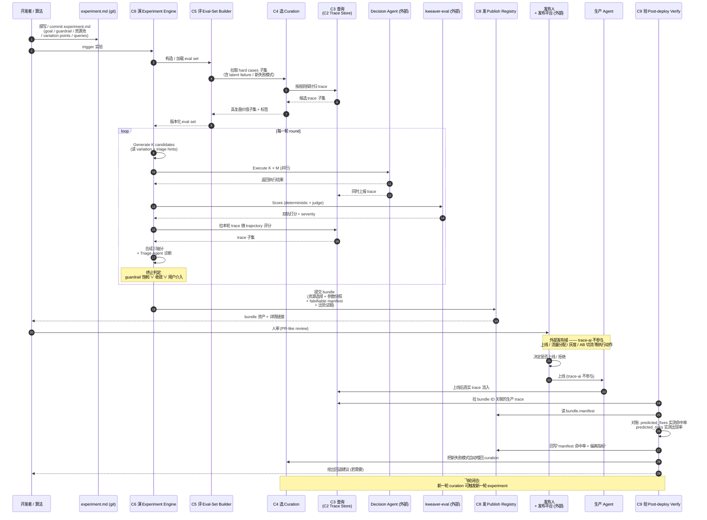
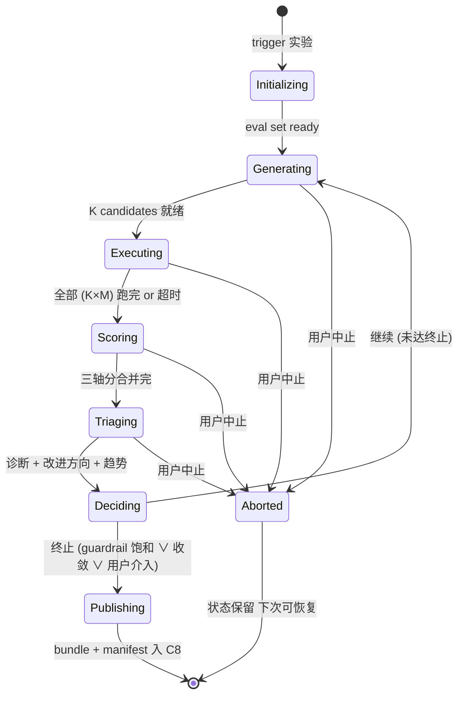
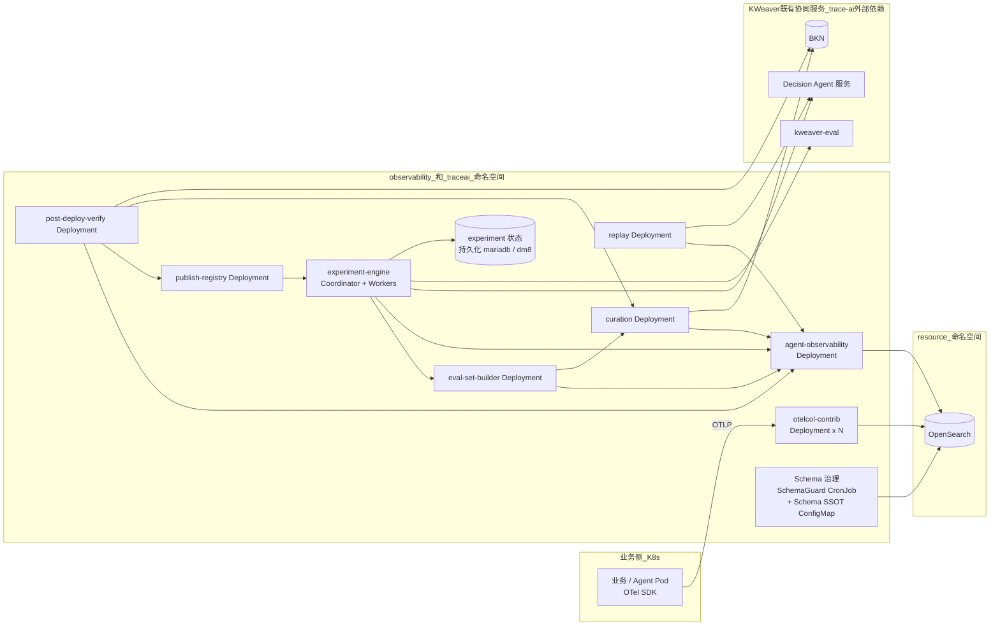

# trace-ai 持续学习中枢 Vision Spec

**Date:** 2026-05-07
**Status:** Draft
**Scope:** Vision-level（不锁 MVP，不替代各二级子模块自身后续 spec）
**Targets:** trace-ai 仓库整体重新立形 — 从"可观测系统"升级为"可观测 + 持续学习"双形态，覆盖 post-deployment agent engineering 的 L0 + L1 + L2 三层

---

## §1 背景

> **核心洞察 —— 智能体轨迹是企业最重要的数字资产之一。**
> 企业要执行的任务（**意图**）与企业的数字孪生资产（**现状** = BKN / Vega / Decision Agent / Execution Factory 资源）之间，永远存在**连接与裂缝**；Agent 轨迹（trace）是这两者交汇时**唯一的一手记录** —— 它既记录了每一次"意图 → 现状 → 执行 → 结果"的完整事实链，也客观裁决了"哪些连接成立、哪些裂缝暴露"。把 trace 沉淀为可分析、可回放、可反驳的资产，就是把企业的提效与优化从经验依赖搬到数据驱动；这是 trace-ai 一切设计的**思想根**，也是 §3.1 四轴业务目标（可追溯 / 可解释 / 可实验 / 可迭代）的共同前提。

### 1.1 现状

**KWeaver 平台栈**：BKN 承载企业知识网络（实体 / 关系 / 事件 / 数据视图）、Vega 提供异构数据虚拟化、Decision Agent 负责任务推理与编排、Execution Factory 负责动作执行环境（Skill 是被 Execution Factory 管理的一类资源）。`trace-ai` 一期围绕 OpenTelemetry 建成了 AI 系统的可观测底座 —— OTel Collector 接入、OpenSearch 存储、`agent-observability` 提供 trace 查询接口，跑通了"埋点 — 采集 — 存储 — 查询"端到端最小路径。

**行业研究底盘**：post-deployment agent engineering 已稳态形成四层工程栈：

| 层 | 关注 | 代表方法（KWeaver triage 索引） |
|---|---|---|
| **L0 Observability Infrastructure** | 结构化轨迹 schema、低成本采样 | AgentTrace、Breaking the Observability Tax |
| **L1 Signal Triage** | 在轨迹上找出"高复盘价值"子集 | Signals、AgentSeer、Trajectory Guard、Sentinel/PhantomPolicy、Near-Miss |
| **L2 Data Reconstruction / Relabeling** | 把 triage 出的轨迹转化为可消费偏好数据 | AgentHER（hindsight relabel）、TSR |
| **L3 Model Alignment** | DPO / RLHF 私有模型微调 | （远期，依赖私有模型，**不在 trace-ai 范围**） |

trace-ai 当前**只完成了 L0 的一半**（schema 不充分），L1 / L2 几乎空白。

### 1.2 问题

把上面的研究底盘对照 trace-ai 当前状态，五个真实痛点显形：

1. **数据沉默 — trace 没有反向驱动系统演进**。轨迹当前是"事后排障凭证"，平时静静躺在 OpenSearch 里。一个 (BKN, Decision Agent, Execution Factory 资源) 组合是好是坏，工程师靠直觉与零散日志判断，没有可声明、可复现、可比较的实验机制。L1 的 Signal Triage、L2 的 Data Flywheel 完全缺位。

2. **Schema 是沉默的封顶器（silent gating constraint）**。AgentTrace、Sentinel、Near-Miss 等方法都强依赖 trace schema 中**完整保留每次 tool call 的 name / args / return / scope / source** —— 任意字段缺失，下游方法立即不可用（Sentinel 实测：scope 标注缺失即让 Coverage recall 从 100% 跌到 40%）。trace-ai 当前 schema 仅保 OTel 默认字段 + `agent.*` 扩展，**对 L1/L2 准入是不充分的**。

3. **生产 trace 与评测体系割裂**。production 中暴露的 hard cases 不会自动沉淀为 eval set；evolve 阶段用什么数据、为什么用、当时表现如何 —— 链路断裂。AgentHER 路线（失败 trace → DPO 偏好数据）在当前 trace-ai 上没有落点。

4. **"为什么变更"无证据链**。一个 Agent 配置从 v1 演到 v2，**理由 / 候选 / 评分 / 选型路径**散落在聊天记录与 PR 评论里。AHE 的核心教训 —— auto-fix loops 必须自带 falsifiable change manifest（predicted_fixes / risk_tasks / 文件级回滚）—— 在 KWeaver 当前没有任何对应物。

5. **观测税（Observability Tax）失控的潜在风险**。Agent 链路从单轮问答演进到多步骤自治执行，trace 量爆炸式增长。trace-ai 当前没有拓扑感知采样、没有动态阈值触发，全量采集随规模增长会撑爆 OpenSearch 写入与查询成本。

### 1.3 触发

- **KWeaver 把"企业数字孪生"作为定位**，意味着每一次 Agent 在生产中的执行都是数字孪生的一次"实验记录"。继续把 trace 当作仪表盘上的指针，会浪费这份基础设施最大的杠杆。
- **Agent 形态从单轮问答演进到多步骤自治执行**，(BKN × Decision Agent × Execution Factory 资源 × 配置) 组合空间爆炸式增长，**靠人手工调校已无法扩展** —— 必须让 trace 数据反过来驱动 Agent 系统的持续学习。
- **行业研究已经把 4 层栈各自的方法论与立场分歧都摸清了**（详见 `research-agent-triage/notes/00_research_landscape.md` 与各论文笔记）。trace-ai 完整接入 L0+L1+L2 的工程窗口已经成熟，再不动手就是把先发优势让给社区。

### 1.4 愿景（终态画像）

trace-ai 的终态不是"更好的可观测平台"，而是把企业**意图与数字孪生现状之间的连接与裂缝**沉淀为可被实验、可被进化的资产层 —— 基于轨迹做并行实验与自动优化，去解决传统知识体系下结构性无解的三类问题：

- **隐形知识沉淀（Tacit Knowledge Harvesting）**：企业里大量"为什么这样做"的领域经验藏在人脑、口口相传的实践、零散文档里 —— 手工 KG / 文档库永远追不上业务实际。trace 是 Agent 撞上这些知识盲点时的客观一手记录；triage + hindsight relabel 让这些隐形知识反向沉淀为显式资产（BKN 节点 / Skill 文档 / Decision Agent 提示 / 偏好对）。
- **本体漂移（Ontology Drift）**：BKN 的 schema / 实体定义 / 关系定义会随业务演化而失真，Agent 用过期本体推理会出错；传统靠人定期 review 永远滞后且粗。trace 记录了每次实际访问的实体 / 关系 / 字段 —— 对照 BKN 现状即可自动发现漂移点、给出修正候选，让本体跟随业务呼吸。
- **智能体自动调优（Agent Auto-tuning）**：(BKN × Decision Agent × Execution Factory 资源 × 配置) 组合空间爆炸，靠人手工调校无法扩展。trace + experiment + triage 让"哪种配置在哪类任务上更优"成为可声明、可实验、可回放、可反驳的工程命题，把"配置工程师靠直觉调 Agent"压缩为"业务专家声明 goal"。

**终态用户旅程**：用户只需声明 **goal + guardrail + 可用资源池**，trace-ai 自动展开 candidate 配置组合 → 多轮并行实验 + 三轴打分 + triage → 产出**满足任务所需的 Decision Agent / BKN / Vega / Execution Factory 资源** bundle，附带 falsifiable manifest 与出处证据，交人审决定上线。本 spec 是这个终态的**第一公里** —— 先把 L0+L1+L2 工程闭环立住（详见 §1.5 范围），让飞轮可以转起来；隐形知识沉淀、本体漂移修复、自动配置生成等更前沿的产物，会在闭环跑通后逐步浮现。

### 1.5 范围

本 spec 描绘 trace-ai 在 KWeaver 数字孪生愿景下的整体形态：

- **覆盖范围 = L0 + L1 + L2**：trace-ai 是 post-deployment agent engineering 在 KWeaver 上的**三层一体**承接者。
  - L0 → trace-ai 的"可观测"顶层能力（采集 / 存储 / 查询 / schema 治理）
  - L1+L2 → trace-ai 的"持续学习"顶层能力（信号分诊 / 数据飞轮 / 实验循环 / 重放 / 发布资产 / 发布后验证）
- **不在范围**：L3 模型对齐 / 私有模型微调依赖企业自有模型与训练资源，本 spec 不涉及；trace-ai 仅产出可被 L3 消费的偏好数据资产。
- **vision-level**：每个二级子模块的具体落地由其自身后续 spec 承接。

---

## §2 名词解释

按"哪一类术语在哪个章节最被反复用到"排成 6 组，便于后续章节回查。

### A. KWeaver 平台栈（背景前置）

| 术语 | 含义 |
|---|---|
| **BKN** | KWeaver 的企业知识网络，承载实体 / 关系 / 事件 / 数据视图 |
| **Vega** | KWeaver 的数据虚拟化层，为异构数据源提供统一 SQL 接口 |
| **Decision Agent** | KWeaver 中负责任务推理与编排的 Agent 资源（含 reasoning / planning / 工具调度） |
| **Execution Factory** | 动作执行环境；管理可被调用的资源（含 Skill、外部 API、数据视图等） |
| **Skill** | Execution Factory 管理的一类可复用动作资源；不是平台栈的顶层概念 |

### B. OpenTelemetry 与可观测协议（已在一期落地）

| 术语 | 含义 |
|---|---|
| **OTel / OTLP** | OpenTelemetry 与其传输协议（gRPC / HTTP），trace/log/metric 的统一上报方式 |
| **OTel Collector** | 接收 — 处理 — 导出的开源遥测组件，trace-ai 通过 `otelcol-contribute-chart` 部署 |
| **Trace / Span / Resource Spans** | OTel 三层数据结构：一次执行 → Span 集合 → 按 service+scope 分组 |
| **ss4o** | OpenSearch Simple Schema for Observability，trace-ai 默认按此 schema 落库 |

### C. Post-deployment Agent Engineering 工程栈层级（贯穿 §3 §6 §7）

| 术语 | 含义 |
|---|---|
| **L0 Observability Infrastructure** | 结构化轨迹 schema、低成本采样、采集存储查询底座（AgentTrace / Breaking Obs Tax 范式） |
| **L1 Signal Triage** | 在轨迹流上低成本筛出"高复盘价值"子集（Signals / Sentinel / Near-Miss / AgentSeer / Trajectory Guard 范式） |
| **L2 Data Reconstruction / Relabeling** | 把 L1 筛出的轨迹转化为可消费的偏好数据 / 实验数据（AgentHER hindsight relabel / TSR 范式） |
| **L3 Model Alignment** | 私有模型 DPO / RLHF 微调（依赖企业自有模型，**不在 trace-ai 范围**） |

### D. 信号与轨迹术语（§3 §5 §7 §8 频用）

| 术语 | 含义 |
|---|---|
| **Trajectory（轨迹）** | 一次任务执行的 span 序列 + events + 关键 attributes 集合 |
| **Signal（信号）** | 在轨迹上可观察到的判别特征：交互层 / 执行层 / 环境层三类 |
| **Triage（分诊）** | 在轨迹流上按"复盘价值"筛选出子集；与 LLM-judge 对立的轻量化路线 |
| **RO（Required Observation）** | 一次合规执行**必须读取**的事实集合；guard-code-as-oracle 反查"应读未读"以发现 latent failure（Near-Miss 范式） |
| **Hindsight Relabel（后见之明重打标）** | 拿失败 / latent-failure 轨迹，重写为"原行为 vs 应有行为"的偏好对（AgentHER 范式） |
| **Observability Tax（观测税）** | 全量 trace 采集随 Agent 链路增长带来的存储与查询成本，需拓扑感知采样应对 |
| **Falsifiable Change Manifest** | 每次 candidate 改动自带"预测会修复哪些 case / 风险哪些 case"，下一轮可机器判决 —— AHE 路线的核心抗 self-deception 机制 |

### E. 实验循环术语（§3 §6 §7 集中使用）

| 术语 | 含义 |
|---|---|
| **Experiment（实验声明）** | 一份用户撰写的 markdown，含 goal / guardrail / 可用资源池 / **可变点（Variation Points）** / 测试 queries（可带可不带 reference answer） |
| **Variation Point（可变点）** | 实验声明中显式列出的"可被搜索的轴"；本 spec 限定为 categorical（"choose-one-from-set"） |
| **Candidate（候选实验组）** | 一次具体的 (BKN 选, Decision Agent 模板选, Execution Factory 资源选, ...) 取值组合 |
| **Round（迭代轮）** | 一次"生成 candidate 集 → 在 query 集上执行 → 三轴打分 → triage" 的完整闭环 |
| **三轴打分（Outcome / Trajectory / Guardrail）** | 一次 (candidate × query) 评分由三轴独立给出后合并：结果质量（LLM judge）、过程质量（轨迹模式）、合规（双轨 guardrail） |
| **Triage Agent（分诊代理）** | 一轮跑完后的"循环大脑"：诊断、给改进方向、给"探索 vs 利用"趋势信号；跨轮持记忆 |
| **Guardrail 双轨** | safety guardrail = hard gate（违反即淘汰），quality guardrail = penalty（违反即扣分） |
| **Bundle（配置资产）** | 一次实验的最终交付物：最佳 candidate 的 BKN / Vega / Decision Agent / Execution Factory 资源选择 + 参数快照 + 出处证据（哪一轮、哪些 query、哪条 trace 支持），人接手发布 |

### F. trace-ai 顶层能力 / 子模块（§6 §7 锁定）

trace-ai 内部分两大顶层能力，下设 9 个二级子模块（其中 3 个已存在 / 6 个待建）：

| 顶层能力 | 子模块 | 状态 | 一句话职责 |
|---|---|---|---|
| **可观测**（落实 L0） | 采集（OTel Collector） | 已存在 | OTLP 接入 + 基础增强 + 导出 |
| | 存储（Trace Store） | 已存在 | OpenSearch + ss4o schema + 索引治理 |
| | 查询（agent-observability） | 已存在 | trace 查询 API + Swagger |
| **持续学习**（落实 L1+L2） | **选** Curation | 待建 | 在生产 trace 流上做 L1 信号分诊，输出高复盘价值子集 |
| | **评** Eval-Set Builder | 待建 | 把 curation 子集 + 用户 queries 整合为可复现 eval 集（含 reference 与不含 reference 两态） |
| | **演** Experiment Engine | 待建 | 实验循环本体：Generate / Execute / Score / Triage 四阶段 + Coordinator FSM |
| | **放** Replay | 待建 | 拿过去某条 trace，用新 candidate 重跑，做"如果当时是这样会怎样" |
| | **发** Publish Registry | 待建 | bundle 资产 + falsifiable change manifest 沉淀；trace-ai 仅产出，不上线 |
| | **验** Post-deploy Verify | 待建 | 发布后追踪生产 trace，对比 manifest 中"预测会修哪些 / 风险哪些"，给出回退建议 |

---

## §3 设计目标与非目标

### 3.1 业务目标

trace-ai 的业务目标围绕 **可追溯 / 可解释 / 可实验 / 可迭代** 四轴展开 —— 四轴构成因果链：先有可信的**调用链**，才能撑起可问责的**证据链**；有了证据链，才能落地可声明的**实验循环**；实验循环跑通，系统才具备 trace 反向驱动配置生成的**迭代闭环**。

**G1 — 可追溯（调用链）。**
任何 Agent 执行中的关键决策、工具调用、知识检索（BKN）、数据访问（Vega）、状态转移，都必须在 trace-ai 上有**结构化、可被消费、可被审计**的留痕。schema 是 silent gating constraint —— trace-ai 是 KWeaver 数字孪生的"调用链底座"，地基不牢则上层全废。

**G2 — 可解释（证据链）。**
每一次系统变更（candidate 选型、bundle 发布、模块迭代）都自带 **falsifiable change manifest**（"预测会修复哪些 query / 风险哪些 query"）+ **出处证据**（哪些 trace / 哪一轮 / 哪份 triage 报告支持这个决策）。为什么从 v1 演到 v2 —— 全部以可机器判决、可人工审计、可回滚的形式沉淀在 publish registry。

**G3 — 可实验（声明驱动）。**
用户撰写一份 `experiment.md`（goal / guardrail 双轨 / 可用资源池 / 可变点 / 测试 queries），即可启动**并行多轮迭代实验**。实验配置由系统按 variation 声明自动展开为 candidate 集合，多轮调度、三轴打分、triage、终止判定全程自动；任何一轮都可在另一台机器复现。

**G4 — 可迭代（trace → 配置生成飞轮）。**
系统基于实验结果与轨迹自动做 triage 分析，产出下一轮的 candidate / Skill 选择 / BKN 拓扑 / Decision Agent 模板等**优化配置建议**；发布后的生产 trace 又自动回流 curation，形成 "trace → 分诊 → 配置生成 → 实验 → 发布 → trace" 的飞轮闭环。trace 不再只是事后排障凭证，而是数字孪生的实验台账。

### 3.2 技术目标

§3.1 的四条业务目标在技术上落地到三轴：**可追溯** 主要由 T1 可观测承接（schema + 关键调用全覆盖）；**可解释** 贯穿 T1（trace 即一手证据）与 T3 闭环进化（manifest + 对账）；**可实验** 与 **可迭代** 由 T2 可分析（信号分诊 + 多维查询）和 T3 闭环进化（实验声明驱动 + 飞轮闭合）共同支撑。

trace-ai 的技术目标围绕三轴展开：**可观测 → 可分析 → 闭环进化**。三者层层递进 —— 可观测是地基（L0），可分析是杠杆（L1），闭环进化是产物（L2）。每一轴一个命题 + 若干可衡量子目标。

#### T1 — 可观测（Observable）

> **命题**：任何 Agent 执行中的关键决策、工具调用、知识检索、数据访问、状态转移，都必须在 trace-ai 上有**结构化、可被消费、可被审计**的留痕 —— schema 是 silent gating constraint，地基不牢则上层全废。

**子目标**：

- **T1.1 Schema 即 SSOT**：trace schema 以 YAML/JSON Schema 形式版本化、可校验、可回溯；字段缺失自动标 `partial_trace` + 触发 `schema_validation_failed`，**绝不静默丢数**。
- **T1.2 关键调用全覆盖**：Decision Agent 的推理步骤、Execution Factory 的资源调用（含 Skill / API / 外部工具）、BKN 检索、Vega 数据查询，每一类都有约定语义属性（`gen_ai.*` + `agent.*`），不靠开发者凭直觉打 tag。
- **T1.3 观测税可控**：拓扑感知采样 + 错误链路全量保留 + 成功链路尾采样 + 大字段摘要化（prompt / response / retrieval 正文不进索引体），保证 trace 量随 Agent 链路深度的增长不撑爆存储。
- **T1.4 自观测闭合**：trace-ai 自己的 9 个子模块（包括 Coordinator / Triage / Replay / Publish Registry / Verify）全部上 OTel 埋点，trace 喂回自己 ——**循环本身可被排障、可被时间旅行**。

#### T2 — 可分析（Analyzable）

> **命题**：原始 trace 流必须能在**低成本**下被加工出"高复盘价值子集"与"可消费的诊断结论" —— 粗筛默认走 rule-based / 状态机 / 声明式不变量，把 LLM-judge 留给小子集与深度任务。"采样信息量"和"判断准确性"是两件事，不能用一种工具把它们都抓了。

**子目标**：

- **T2.1 多维查询任意组合**：trace 可按 `trace_id` / `experiment_id` / `candidate_id` / `round` / `conversation_id` / `agent_id` / `tool_name` / 时间窗 / `agent.trace.type` 任意组合检索 + 聚合；查询契约稳定，UI / 排障 / 实验引擎共用一套。
- **T2.2 轻量信号优先**：L1 分诊默认 rule-based 探针（Signals 三层信号：交互 / 执行 / 环境）+ 状态机 + Sentinel 风格的声明式 KG 不变量；LLM-judge 限定在 triage 出的小子集和 hindsight relabel 阶段。
- **T2.3 规则与诊断可审计、可驳回**：每一条 triage 规则、每一份诊断报告都可被列出、被审视、被人工驳回；Triage Agent 的每次诊断附带"我读了哪些 trace、用了哪些规则、跳过了什么"，本身可被回看（即 T1.4 的延伸）。
- **T2.4 分析延迟可工程化**：在 N=10k 量级 trace 上完成一次 round 的全量分诊与三轴打分，wall-clock ≤ 数分钟（具体阈值由各子模块自身 spec 锁定）。

#### T3 — 闭环进化（Closed-loop Evolution）

> **命题**：trace 数据必须能驱动 (BKN, Vega, Decision Agent, Execution Factory) 组合的**可声明、可复现、可审计**的自动迭代；每一次系统变更自带"预测 — 验证 — 回退"的证据链。**自审是循环可信的前提**，没有 self-audit 的 auto-fix loop 是 thesis 明确反对的反模式。

**子目标**：

- **T3.1 实验声明驱动**：experiment.md（含 goal / guardrail 双轨 / 资源池 / 可变点 / 测试 queries）走 git 管理；多轮迭代 → bundle 资产链路端到端可被 review，**任何一轮都可在另一台机器复现**。
- **T3.2 自带 falsifiable manifest**：每个新 candidate / 新 bundle 必须给出"预测会修复哪些 query / 风险哪些 query"，下一轮机器判决并回写"预测命中率" —— 这是抗 self-deception 的核心机制（参考 AHE：fix-prediction 5× / regression-prediction 2× random）。
- **T3.3 资产沉淀化**：实验过程（每轮的 candidate 集 / 三轴评分 / triage 报告）、选型证据（哪些 trace 支持哪个判断）、发布资产（bundle）、验证结果（manifest 对账）全部进 publish registry，可机器查询、可人工审计。
- **T3.4 闭环重入生产**：发布后生产 trace 自动喂回 verify 子模块，对照 bundle 自带的 manifest 给出"实测命中率 / 回退建议"；这次验证本身又是新一轮 curation 的输入 —— **飞轮闭合**。

#### 3.2 之外的支撑性约束

下列工程约束不是技术目标的"主轴"，而是支撑这三轴落地的边界：放到 §9 边界考虑里详细写，§3 这里只点名。

- 高可用 / 无状态横向扩展（K8s Deployment + 断点续跑）
- 写入 / 查询 SLA（沿用一期 PRD：trace 详情 P95 ≤ 2s、5 分钟可查询率 ≥ 95%、查询服务 SLA ≥ 99.9%）
- 模块边界与 API 契约稳定（独立编译 / 独立部署 / 不共享 DB 表）
- 国产化适配（HCE / openEuler / dm8 / MariaDB）
- 可部署、可灰度（Helm + feature flag + 流量路由）

### 3.3 非目标

**N1 — 不做 L3 模型对齐 / 私有模型微调。**
trace-ai 仅产出"可被 L3 消费的偏好数据资产"（hindsight-relabeled pairs / preference dataset），不做 DPO / RLHF / SFT。微调依赖企业自有模型与训练资源，是独立工程。

**N2 — 不建设完整可视化 observability 产品。**
trace-ai 只对外暴露查询接口与统一数据模型，UI 由 KWeaver 上层产品（dataflow、agent factory 等）承接调用。不复刻 Datadog / Grafana 的视图能力。

**N3 — 不做发布执行 / 在线实验平台。**
publish registry 只产出可复现的 bundle 资产，搭配 falsifiable manifest 与出处证据，"是否上线、怎么切流、何时回滚"由人或独立的发布平台决定。具体地：trace-ai **不负责** A/B 实验设计、流量分配、在线对照组管理、金丝雀 / 灰度策略、回滚执行 —— 这些是发布平台 / 实验平台的职责。trace-ai 仅观测发布后的真实 trace 与 manifest 对账（这是 verify 子模块的职责），且对外部平台用什么策略分流不感知、不依赖。

**N4 — 不替代 kweaver-eval。**
实验循环的 Score 阶段把 `kweaver-eval` 作为"评分函数原语"调用，复用其双轨打分（deterministic + agent judge）与 severity 分级，不重建评测体系。

**N5 — 不做通用 AutoML / 超参优化框架。**
variation 限定为 categorical（"choose-one-from-set"）。不支持连续超参、组合约束 DSL、generator 函数。这是 YAGNI 决定，期望 80% 场景被覆盖。

**N6 — 不绑定单一存储产品。**
一期主路径走 OpenSearch + ss4o，但所有跨子模块的契约都以"逻辑 schema + 查询接口"为锚，不以"OpenSearch DSL"为锚。后续可平滑切换到 ClickHouse / 自研引擎。

**N7 — 一期不建独立的权限中心 / RBAC / 字段级访问控制 / 审计日志。**
按平台总体安全方案承接。trace-ai 子模块的 API 只承诺正确性与可观测性。

### 3.4 成功判据（vision-level，不锁 SLO）

| 维度 | "在路上"的指征 |
|---|---|
| 闭环跑通 | 一份完整的 experiment.md → 多轮迭代 → 产出 bundle + manifest → 发布后 verify 给出"预测命中率"；首条端到端走完即视为里程碑 |
| Schema 健康度 | 关键字段（tool name/args/return/scope/source/latency/status）非空率 ≥ 95%；缺失即触发 schema_validation_failed 事件 |
| Triage 信噪比 | curation 输出的"高复盘价值子集"在二次人工抽样验证下 informativeness 不低于行业 baseline（Signals 论文 ~82%）|
| Manifest 可信度 | publish registry 中每个 bundle 的 manifest，post-deploy verify 阶段实测命中率显著高于随机（参考 AHE：fix-prediction 5× / regression-prediction 2×）|
| 模块独立性 | 任意二级子模块的实现可被替换为 mock 或新版本，整体闭环不破 —— 通过契约测试验证 |
| 观测税 | 单 query 的 trace 量在采样后保持可控；具体阈值由 L0 子模块自身 spec 定 |

---

## §4 能力与功能设计

trace-ai 整体提供 **9 项二级子能力**，分布在两大顶层能力（可观测 / 持续学习）之下。每项给出：命题、输入、输出、关键功能点、依赖。本节只到"能力"层，模块物理实现见 §7。

### §4.1 可观测能力（落实 L0）

#### C1 数据接入（采集 / Ingestion）

> **命题**：让任意 KWeaver 内 / 外的 Agent 应用都能以**零侵入或低侵入**的方式把执行轨迹送进 trace-ai。

- **输入**：业务侧 OTel SDK 上报的 OTLP 数据（trace / log / metric）
- **输出**：经基础增强后的结构化 trace 文档，写入 Trace Store
- **关键功能点**：
  - OTLP gRPC (4317) / HTTP (4318) 双协议接入
  - 基础增强：注入 service / tenant / 环境元数据；字段别名兼容
  - 拓扑感知采样：错误链路 100% 保留，成功链路按租户 / Agent / 流量尾采样
  - Memory limiter + batch processor 防突发流量打挂
  - 大字段裁剪（prompt / response / retrieval 正文摘要 + 哈希）

#### C2 数据存储（Trace Store）

> **命题**：保证 trace 落得下、查得回、不撑爆。

- **输入**：来自 C1 的结构化 trace 文档
- **输出**：按信号类型 + 日期切分的索引集合，可被 C3 / 持续学习层各能力消费
- **关键功能点**：
  - 一期 OpenSearch + ss4o schema 主路径，但内部跨能力契约**不绑 OpenSearch DSL**（保 ClickHouse / 自研引擎可替换性）
  - 高频过滤字段建 keyword 索引（trace_id / agent_id / conversation_id / experiment_id / candidate_id / agent.trace.type / tool_name / status）
  - 保留周期、索引前缀、分片策略全部可配置
  - 故障降级：部分索引不可用时，明细查询仍可用，聚合允许降级

#### C3 数据查询（Query / agent-observability）

> **命题**：对**所有上层能力** —— UI、排障工具、实验循环、replay、verify —— 提供唯一的 trace 查询入口。

- **输入**：HTTP 查询请求（结构化条件 / 受控 DSL / 按 ID 取详情）
- **输出**：统一格式的 trace / span / event 集合
- **关键功能点**：
  - 多维查询：trace_id / experiment_id / candidate_id / round / conversation_id / agent_id / tool / 时间窗任意组合
  - 高频便捷接口（按 conversation 取所有 span / 按 trace_id 取详情）
  - 通用受控 DSL（裹好的 OpenSearch DSL 入口，带租户隔离与查询配额）
  - 查询超时统一 504、schema 不一致返回 partial_trace 标记不丢数
  - Swagger 自动生成、对外文档与代码同步

#### X1（横切）Schema 治理

> **命题**：schema 是 silent gating constraint，必须作为 SSOT 跨 9 个子能力共享。

- **输入**：schema 版本声明 + 字段约束
- **输出**：跨子模块共享的契约文档 + 自动校验器
- **关键功能点**：
  - 一份版本化（`schema_version`）的 trace schema 定义文件，归 trace-ai 仓库根管理
  - 校验器（SchemaGuard）：异步抽样校验 → 标 partial_trace + 告警
  - 字段别名兼容（如 `session_id → agent.session.id`），兼容表也版本化
  - 必填字段清单（针对 L1/L2 准入）：tool name/args/return/scope/source/latency/status；缺失即告警

### §4.2 持续学习能力（落实 L1 + L2）

#### C4 信号分诊（Curation / 选）

> **命题**：在生产 trace 流上以**低成本**筛出"高复盘价值子集" —— 失败链路、慢链路、latent failure（绕过 RO 的成功链路）、规则违反、新模式异常等。

- **输入**：来自 C3 的 trace 流（可按时间窗 / 租户 / Agent 维度拉取）
- **输出**：高复盘价值的 trace 子集 + 每条 trace 的"为什么进入子集"标签集合
- **关键功能点**：
  - 三层信号探针（Signals 风格）：交互层（用户语义异常）/ 执行层（步骤异常 / 工具失败模式）/ 环境层（KG 不变量违反）
  - 声明式不变量（Sentinel / PhantomPolicy 风格）：在 BKN 上声明"若 X 则必读 Y / 必写 Z"，违反入子集
  - Latent failure 检测（Near-Miss 风格）：guard-code-as-oracle 反查"应读未读的 RO"，在成功 trace 中找隐性失败
  - 拓扑异常（AgentSeer 风格）：把 trace 视为 action-component graph，检测拓扑层异常
  - 规则可解释、可驳回、可版本化（每条规则有 `rule_id` + `rule_version`，对应一份 yaml）
  - 不默认调 LLM；LLM-judge 留给后续 hindsight relabel 阶段

#### C5 评测集构造（Eval-Set Builder / 评）

> **命题**：把 C4 的子集 + 用户给的 queries（含 / 不含 reference）整合成**可复现、可版本化、可对比**的 eval 集。

- **输入**：用户在 experiment.md 中声明的 queries + C4 输出的子集
- **输出**：版本化的 eval set 文档（含 query / 可选 reference / source / weight / labels）
- **关键功能点**：
  - 两态支持：query 带 reference（可走 deterministic 打分）/ 不带 reference（走三轴打分中的 outcome+trajectory 组合）
  - 来自 trace 圈选：UI / DSL 圈出 N 条历史 query，自动脱敏后入 eval set
  - 来自 hindsight relabel：把 latent failure 的"原行为 vs 应有行为"沉淀为偏好对（AgentHER 风格），是 L3 的天然原料
  - eval set 走 git 管理、可 diff、可 review；版本化后被 experiment engine 引用

#### C6 实验循环（Experiment Engine / 演）

> **命题**：让一份 experiment.md 自动跑出最佳 candidate + 可信证据链。

- **输入**：experiment.md（goal / guardrail 双轨 / 资源池 / 可变点 / queries）+ C5 提供的 eval set
- **输出**：每轮的 candidate 集合 / 三轴评分 / triage 报告 + 终结轮的最佳 candidate（→ C8）
- **关键功能点**：
  - 4 阶段流水线 + Coordinator FSM：Generate → Execute → Score → Triage（详见 §7）
  - Generate：纯函数，读 variation 声明 + triage hints 产出 categorical 候选
  - Execute：调度到 Decision Agent / Execution Factory，K candidate × M query 并行
  - Score：复用 kweaver-eval（双轨打分 + severity）+ trace 三轴合成（Outcome / Trajectory / Guardrail）
  - Triage Agent：诊断 + 改进方向 + 探索/利用趋势信号 + 跨轮记忆
  - Guardrail 双轨：safety = hard gate（淘汰）/ quality = penalty（扣分）
  - 终止：guardrail 饱和 ∨ 收敛 ∨ 用户介入
  - 全程产 OTel trace 喂回 trace-ai 自己

#### C7 轨迹重放（Replay / 放）

> **命题**：拿一条历史 trace（生产或 eval set）用一个新 candidate 重跑，回答"如果当时是这个配置会怎样"。

- **输入**：trace_id 或 (experiment_id, query) 元组 + 待评估 candidate
- **输出**：新 trace + 与原 trace 的逐 span 对比（步骤数 / 工具选择 / 检索命中 / 最终输出 / 三轴评分对比）
- **关键功能点**：
  - 仅按"输入面"重放：原始 user query + 上下文 + 工具响应可被 mock（成本可控）
  - 严格模式 / 对比模式 / 探索模式三档（用户可选）
  - 重放本身产 trace 喂回 trace-ai，并标 `replay_of=<原 trace_id>`
  - 是 verify 子能力的可选输入；也是排障工程师的"假设性问题"工具

#### C8 发布资产（Publish Registry / 发）

> **命题**：把"最佳 candidate"沉淀为可复现、自带 manifest 的 bundle 资产；trace-ai 仅产出，不上线。

- **输入**：来自 C6 的最佳 candidate + 整轮实验的元数据
- **输出**：bundle 资产（资源选择 + 参数快照 + falsifiable change manifest + 出处证据）
- **关键功能点**：
  - bundle 内容：BKN / Vega / Decision Agent 模板 / Execution Factory 资源选择 + 各自的版本快照 + 实验 ID + 选型轮次
  - falsifiable change manifest：声明"预测会修复哪些 query / 风险哪些 query / 关键边界条件"
  - 出处证据：哪些 trace、哪些 round、哪些 triage 报告支持这个 candidate
  - 版本化：每个 bundle 有唯一 ID + 校验和；可被 git 引用、可被 PR review
  - 不触发上线：bundle 仅作为"资产"产出，发布动作由人或独立平台承接

#### C9 发布后验证（Post-deploy Verify / 验）

> **命题**：bundle 上线后，自动监控生产 trace，把"实测表现"对照 bundle 自带的 manifest 进行机器对账。**C9 是被动观测式对账，不是在线实验执行器** —— 不分配流量、不管理对照组、不执行回滚；产出的"回退建议"是给人/发布平台的输入，trace-ai 自己不动手。

- **输入**：已上线的 bundle ID + 上线后一段时间窗的生产 trace
- **输出**：对账报告（manifest 命中率 / 偏离指标 / 回退建议）+ 失败案例自动喂回 C4
- **关键功能点**：
  - manifest 中"预测会修复"的 query 模式 → 实测是否真修复
  - "预测风险"的 query 模式 → 实测是否真出问题
  - 生产 trace 中出现的新失败模式 → 自动入 C4 形成新一轮 curation 输入
  - 命中率显著低于阈值（参考 AHE：fix-prediction 5× random / regression-prediction 2× random）→ 给出回退建议
  - 验证报告归档进 publish registry，作为下次实验的输入证据

### §4.3 跨能力的数据流（preview，详见 §6）

```
生产 Agent ──产 trace──▶ C1 ──▶ C2 ──▶ C3
                                          │
                       ┌──────────────────┘
                       ▼
                       C4 ─选─▶ C5 ─评─▶ C6 ─演─▶ C8 ─发─▶（人审 + 上线）
                                  ▲          │              │
                                  │          ▼              ▼
                                  │         C7 ─放─▶（排障 / verify input）
                                  │                            │
                                  └────────── C9 ─验─◀─ 生产 trace
```

闭环图最终态在 §6 给完整 mermaid。

---

## §5 设计思路与折衷

把 trace-ai 整体设计的"为什么这样做"拆成两层：上层是**主导思想**（不可妥协的设计立场，决定 trace-ai 的"性格"），下层是**关键折衷**（在等价路径中选了哪一条、放弃了什么）。

### §5.1 主导思想（5 条）

#### 思想 1 — 轻量信号优先，LLM-judge 留给小子集

"采样信息量"和"判断准确性"是两件事 —— 前者用规则 / 状态机 / 声明式不变量足够，把 LLM-judge 留给 triaged 后的小子集和深度任务。

**实证**：[13] AgentDebug 的 detector 强依赖 GPT-4.1，换 Llama-3.3-70B 后 All-Correct 从 32% 跌到 6% —— LLM-judge 在前线全量使用既贵、又脆、又不可解释。

**落地**：C4 信号分诊**默认不调 LLM**；LLM 只在 hindsight relabel（C5）、深度诊断（Triage Agent，C6）、Outcome 打分（C6 score 阶段、且只对 triaged 后的小子集）三处启用。

#### 思想 2 — 自审是循环可信的前提

任何 auto-fix loop 必须自带 falsifiable change manifest（"预测会修哪些 / 风险哪些"），下一轮机器判决并回写命中率。否则就是 thesis 明确反对的反模式。

**实证**：[12] AHE 显式量化 evolve agent 的 fix-prediction（5× random）和 regression-prediction（2× random）；[14] Autodata 同源方法但缺 self-audit，落入反模式。

**落地**：C8 publish registry **强制要求**每个 bundle 自带 manifest；C9 verify 子能力存在的全部理由就是为了机器对账这份 manifest。**没有 manifest 的 bundle 不允许进 registry。**

#### 思想 3 — 人保留可问责的闸门（Human-in-the-loop on Publish）

数字孪生的核心是"可被人审"，不是"完全自动化"。trace-ai 的循环可以一路自动到 bundle，但**上线动作必须保留人的决策**。

**落地**：C8 仅产出 bundle 资产、出处证据与 manifest；切流量 / 灰度 / 回滚都不在 trace-ai 内部。这是 N3 非目标的根因。

#### 思想 4 — 全闭环自观测

trace-ai 自己的每一个子能力都产 OTel trace 喂回自己 —— curation / experiment / replay / publish / verify 都是它自己的"用户"。

**落地**：让 trace-ai 在生产中**可排障、可时间旅行、可被自己分析**；这也是为什么循环失败时根因可被追溯（而不是黑盒）。

#### 思想 5 — Variation 仅 categorical 是 YAGNI 决定

期望 80% 实验场景被 categorical 覆盖；保留连续超参 / DSL / generator 函数会让搜索空间不可证、决策不可审、引入额外评测成本。

**落地**：experiment.md 的 variation 语法封闭（"choose-one-from-set"），后续若证伪再扩展。**一开始就开放是工程灾难。**

### §5.2 关键设计折衷（5 条）

| # | 决策 | 选了 | 没选 | 理由 | 代价 / 已知风险 |
|---|---|---|---|---|---|
| **D1** | 持续学习能力放哪 | trace-ai 内做 6 个二级子模块 | 独立顶层模块（如 `agent-evolve`） | 同一份 trace 数据复用；C9 verify 闭环喂回 C4 curation 必须共底座 | trace-ai 仓库定位变重，README / PRD / CHANGELOG 全要重写 |
| **D2** | 实验循环架构 | 分阶段流水线 + Coordinator FSM（方案 A） | Triage 中心化（方案 B）/ 全 dogfood Decision Agent（方案 C） | 每阶段契约独立、可恢复、可并行；triage 仍是有记忆的 agent，但不统揽全部 | Coordinator 需要状态机 + 持久化 |
| **D3** | 评分维度 | 三轴合并（Outcome / Trajectory / Guardrail） | 单标量综合分 | 抗 reward hacking；guardrail 双轨清晰；trajectory 单独成轴让"过程合理性"独立可见 | 三轴权重需配置；可解释性向量化（不是单数字） |
| **D4** | Guardrail 模型 | 双轨：safety = hard gate / quality = penalty | 单一 hard gate / 单一 penalty | safety 不可妥协（直接淘汰）；quality 是连续权衡（扣分） | experiment.md 中每条 guardrail 多一个 `kind` 字段 |
| **D5** | Publish 出口 | 仅产出 bundle 资产 + manifest | 自动金丝雀 / AB 切流 | 思想 3 的工程落地；上线由人或独立平台负责，可问责 | 闭环不自动落地到生产；trace-ai 与发布平台之间有人工接缝 |

---

## §6 总体架构

### §6.1 逻辑分层架构图

trace-ai 内部按"接入 → 存储 → 查询 → 学习"四层分层，加一道横切的 Schema 治理。外部世界从上下两侧接入：上侧是数据生产者（业务系统 / Decision Agent / Execution Factory），下侧是数据消费者（开发者 / 算法 / 平台 UI / 待发布平台）。

```mermaid
graph TB
    subgraph 数据生产者_外部
        BIZ[业务系统]
        DA[Decision Agent]
        EF[Execution Factory<br/>含 Skill / Vega / 工具资源]
        BKN[(BKN 知识网络)]
    end

    subgraph L0a_接入层
        C1[C1 采集<br/>otelcol-contrib]
    end

    subgraph L0b_数据底座
        C2[C2 存储<br/>OpenSearch + ss4o]
    end

    subgraph L0c_查询层
        C3[C3 查询<br/>agent-observability]
    end

    subgraph L1_L2_持续学习层
        C4[C4 选 Curation]
        C5[C5 评 Eval-Set]
        C6[C6 演 Experiment Engine]
        C7[C7 放 Replay]
        C8[C8 发 Publish Registry]
        C9[C9 验 Post-deploy Verify]
    end

    subgraph Schema横切
        X1[X1 Schema 治理 SSOT<br/>+ SchemaGuard]
    end

    subgraph 数据消费者_协同系统
        UI[KWeaver 平台 UI]
        DEV[开发者 / 算法]
        EVAL[kweaver-eval<br/>评分函数原语]
        DEPLOY[发布平台 / 人]
    end

    BIZ --> C1
    DA --> C1
    EF --> C1
    BKN -. 被 C4/C9 反查 .-> C4

    C1 --> C2
    C2 --> C3

    C3 --> C4
    C3 --> C7
    C3 --> C9
    C4 --> C5
    C5 --> C6
    C6 --> C8
    C6 -. score 调用 .-> EVAL
    C6 -. execute 调用 .-> DA
    C7 -. 输入 .-> C9

    C8 --> DEPLOY
    DEPLOY -. 上线后 trace .-> C1

    C9 -. 命中率回写 .-> C8
    C9 -. 新失败模式喂回 .-> C4

    X1 -. 校验 .-> C1
    X1 -. 校验 .-> C2
    X1 -. 校验 .-> C3
    X1 -. 契约 .-> C4
    X1 -. 契约 .-> C5
    X1 -. 契约 .-> C6
    X1 -. 契约 .-> C7
    X1 -. 契约 .-> C8
    X1 -. 契约 .-> C9

    UI -.调用.-> C3
    UI -.调用.-> C8
    UI -.调用.-> C6
    DEV -.调用.-> C3
    DEV -.编辑 experiment.md.-> C6

    classDef l0 fill:#e6f7ff,stroke:#1890ff
    classDef l12 fill:#fff7e6,stroke:#fa8c16
    classDef cross fill:#f6ffed,stroke:#52c41a
    class C1,C2,C3 l0
    class C4,C5,C6,C7,C8,C9 l12
    class X1 cross
```

**要点**：

- **L0（蓝）**：可观测层 = 接入 / 存储 / 查询；任何外部写入只走 C1，任何上层读取只走 C3。
- **L1+L2（橙）**：持续学习层 = 选 / 评 / 演 / 放 / 发 / 验；6 个能力之间通过共享的 trace + bundle 资产协同，**不直接共享数据库表**。
- **横切（绿）**：Schema 治理 SSOT 校验 L0 三层、约束 L1+L2 六个能力的契约；schema 违反**只标不丢**。
- **外部边界**：trace-ai 唯一允许调用的外部能力是 Decision Agent（实验执行）、kweaver-eval（评分原语）、BKN（知识反查）；一切**发布执行类动作**（上线、流量分配、灰度、AB 切流、回滚执行）交给 `DEPLOY`，不在 trace-ai 边界内。

### §6.2 核心业务流程图（端到端持续学习飞轮）

> 这是 trace-ai 的"主旋律" —— 一份 experiment.md 如何走完"声明 → 迭代 → 资产 → 上线 → 验证 → 喂回"完整闭环。



**要点**：

- **三处自动循环**：（i）实验内部多轮 round；（ii）C9 验证回写 C8 命中率；（iii）C9 失败模式喂回 C4 触发下一实验。
- **唯一一处人工闸门**：`Dev → Human → Prod` 这一段。trace-ai 主动声明不接管。
- **trace 的双重角色**：既是被采集的事实（C1→C2→C3），又是被分析的素材（C3→C4 / C6 / C7 / C9）。
- **bundle 是循环的"瞬时记忆"，manifest 是"自审凭据"**：两者绑死、不可拆分。

### §6.3 实验循环单轮内部细化（C6 内部 FSM）

> 这是 §6.2 的 loop 段放大 —— 展示 C6 Coordinator 的状态机。



**要点**：

- 6 个稳定态 + 1 个终态：状态持久化在 Coordinator 自己的存储（独立于 trace store），Pod 漂移可断点续跑。
- `Aborted` 不是终态 → 状态保留，用户可在 UI 上点继续 / 改 experiment.md 重跑。
- `Generating` 阶段不只是采样：它读 Triage Agent 上一轮的 hints，**有方向地**采样下一批 candidate。
- `Triaging` → `Deciding` 之间是循环大脑做最重的判断：是继续？转方向？还是宣告 publish？

### §6.4 部署拓扑（简）



**要点**：

- 持续学习层 6 个子模块都是独立 Deployment，互不共用 Pod。
- `experiment-engine` 是唯一带持久化的（Coordinator 状态 + 存历史 round 元数据），其他子模块无状态。
- `mariadb / dm8` 配合国产化适配（迁移文件已在仓库 `agent-observability/migrations/{mariadb,dm8}` 占位）。
- OpenSearch 仍在 `resource` 命名空间，按平台既定方式访问。
- trace-ai 自身**也是 KWeaver 平台栈的一部分**（见 §1.1）；本图右侧框只列出 trace-ai 调用的**既有协同服务**，不代表平台边界。

---

## §7 模块设计

> 给每个子能力对应的物理模块定义最小契约：物理位置 / 入口契约 / 内部要做的事 / 依赖关系。具体 API schema 留给各模块自己的子 spec。

### §7.1 已有模块（保留 + 扩张）

#### M1 — 采集（otelcol-contribute-chart）

- **路径**：`trace-ai/otelcol-contribute-chart/`（不动）
- **入口契约**：OTLP gRPC `:4317` / HTTP `:4318`
- **内部要做的事**：在现有 receivers / batch / exporter 链路上，扩张三件 ——
  - tail sampling processor（错误链路 100% 保留 / 成功链路按租户 + Agent 采样）
  - 字段裁剪 + 大字段摘要（prompt / response / retrieval 正文用哈希 + 长度 + 截断版替代正文）
  - schema 校验 hook（接到 X1 SchemaGuard 的规则，对不合规字段标记 `partial_trace` 但不丢弃）
- **依赖**：OpenSearch（M2）、X1 schema 治理

#### M2 — 存储（OpenSearch + 索引治理）

- **路径**：trace-ai 仓库不直接管 OpenSearch 实例，但管：
  - `trace-ai/migrations/{mariadb,dm8}/`：experiment 状态等元数据 RDB 迁移
  - 一份 OpenSearch 索引模板（新增 `trace-ai/storage-templates/`）
- **内部要做的事**：索引模板（按信号类型 + 日期分索引）、keyword 字段定义（trace_id / experiment_id / candidate_id / round / agent_id / tool_name 等）、保留策略（按租户配置）
- **依赖**：X1 schema 治理

#### M3 — 查询（agent-observability，扩张）

- **路径**：`trace-ai/agent-observability/`（保留并扩张）
- **入口契约**：HTTP `/api/agent-observability/v1/...`
- **要扩张的接口**（在现有 `_search` / `by-conversation` 之上）：
  - `GET /traces/{trace_id}` — 设计 PRD 已承诺，一期落地
  - `GET /traces?experiment_id=&candidate_id=&round=` — 实验维度查询（C6 / C9 用）
  - `GET /traces?conversation_id=&time_range=` — 加时间窗 + 分页
  - `GET /traces/diff?a=&b=` — 两条 trace 逐 span diff（C7 / C9 用）
  - 加查询配额（`max_time_range_hours` / `max_size`）+ 租户隔离
- **依赖**：M2 存储；X1 schema

### §7.2 新增模块（6 个 L1+L2 子能力）

#### M4 — 选 / Curation

- **路径**：`trace-ai/curation/`
- **入口契约**：
  - `POST /curate/scan` — 在指定时间窗 / 租户范围内扫 trace 流，输出"高复盘价值子集"
  - `GET /rules` / `POST /rules` — 规则注册 + 版本化
- **内部要做的事**：
  - 三层信号探针（交互 / 执行 / 环境）+ 状态机检测器
  - 声明式不变量（在 BKN 上声明"若 X 则必读 Y / 必写 Z"）
  - Latent failure 检测（guard-code-as-oracle）
  - 默认不调 LLM；LLM 留给 hindsight relabel（M5）
- **依赖**：M3 查询；BKN（外部，反查不变量）

#### M5 — 评 / Eval-Set Builder

- **路径**：`trace-ai/eval-set-builder/`
- **入口契约**：
  - `POST /eval-sets` — 由 (queries + curation 子集) 构造 eval set
  - `GET /eval-sets/{id}` — 拉取版本化的 eval set
  - `POST /eval-sets/{id}/relabel` — hindsight relabel（LLM 在此启用）
- **内部要做的事**：
  - 从 trace 圈选 query → 自动脱敏 → 入 eval set
  - 两态支持：带 reference / 不带 reference
  - Hindsight relabel：把 latent failure 的"原行为 vs 应有行为"沉淀为偏好对
  - eval set 版本化：可被 git 引用、可被 PR review
- **依赖**：M4 curation；M3 查询；外部 LLM（仅 relabel 阶段）

#### M6 — 演 / Experiment Engine

- **路径**：`trace-ai/experiment-engine/`
- **入口契约**：
  - `POST /experiments` — 提交 experiment.md（解析 + 校验）
  - `POST /experiments/{id}/start` — 触发实验
  - `GET /experiments/{id}` — 查询状态 / 进度 / 历轮结果
  - `POST /experiments/{id}/abort` — 中止（保留状态）
  - `POST /experiments/{id}/resume` — 续跑
- **内部子组件**：
  - **Coordinator**：FSM 驱动 + 状态持久化（独立 RDB）+ 跨 round 编排
  - **Generator**：纯函数，读 variation 声明 + Triage hints 出 categorical 候选
  - **Executor**：调度 (K candidate × M query) 并行到 Decision Agent
  - **Scorer**：调用 kweaver-eval 走 deterministic + judge 双轨 + 三轴合成
  - **Triage Agent**：诊断 + 改进方向 + 探索/利用趋势 + 跨轮记忆（独立持久化）
  - **Termination Decider**：guardrail 饱和 ∨ 收敛 ∨ 用户介入三选一
- **依赖**：M5 eval-set；M3 查询；外部 Decision Agent；外部 kweaver-eval；持久 RDB（mariadb / dm8）

#### M7 — 放 / Replay

- **路径**：`trace-ai/replay/`
- **入口契约**：
  - `POST /replays` — `{trace_id 或 (experiment_id, query)} + candidate` 重跑
  - `GET /replays/{id}` — 取重跑结果 + diff
- **内部要做的事**：
  - 仅按"输入面"重放：原始 user query + 上下文 + 工具响应可被 mock（成本可控）
  - 严格 / 对比 / 探索三档（YAGNI 警示：可降级为单档，留扩展位）
  - 重放本身产 trace 喂回 M1，且标 `replay_of=<原 trace_id>`
- **依赖**：M3 查询；外部 Decision Agent

#### M8 — 发 / Publish Registry

- **路径**：`trace-ai/publish-registry/`
- **入口契约**：
  - `POST /bundles` — 提交 bundle（必带 manifest，否则拒绝）
  - `GET /bundles/{id}` — 取 bundle + manifest + 出处证据
  - `GET /bundles?experiment_id=` — 按实验列出 bundles
  - `POST /bundles/{id}/verifications` — 上线后验证结果回写（由 M9 调用）
- **内部要做的事**：
  - bundle schema：资源选择 + 参数快照 + falsifiable manifest + 出处证据 + 校验和
  - **强制约束**：`manifest` 字段缺失或不合规 → 拒收
  - 版本化、可被 git 引用、可被 PR review
- **依赖**：M6 实验产出；M9 写回验证结果

#### M9 — 验 / Post-deploy Verify

- **路径**：`trace-ai/post-deploy-verify/`
- **入口契约**：
  - `POST /verifications` — 启动一次发布后验证（绑定 bundle_id + 时间窗）
  - `GET /verifications/{id}` — 取对账结果
- **内部要做的事**：
  - 拉 bundle 关联的生产 trace（按 bundle_id / agent_id / 时间窗）
  - 读 bundle.manifest 中"预测会修复 / 预测风险"的 query 模式
  - 实测命中率对账：predicted_fixes 实测命中率、predicted_risks 实测出现率
  - 命中率显著低于阈值 → 给回退建议
  - 新失败模式自动喂回 M4 curation
- **依赖**：M3 查询；M8 publish；M4 curation；BKN（不变量校验）

### §7.3 横切模块

#### MX1 — Schema 治理（SSOT + SchemaGuard）

- **路径**：`trace-ai/schema/`
  - `schema/v1/trace.yaml`、`schema/v1/experiment.yaml`、`schema/v1/bundle.yaml`、`schema/v1/manifest.yaml`、`schema/v1/eval-set.yaml`
- **入口契约**：
  - 各 schema 文件以 YAML / JSON Schema 格式发布；版本化、可校验
  - SchemaGuard 跑成 CronJob，异步抽样校验 trace
  - 提供轻量 CLI：`schema-tool validate <file>` 给开发者本地校验
- **内部要做的事**：
  - 必填字段清单（针对 L1/L2 准入）
  - 字段别名兼容表（如 `session_id → agent.session.id`）
  - 兼容窗口（每个 minor version 至少保留一个 minor 的并行期）
  - 违反字段统一标 `partial_trace` + 触发 `schema_validation_failed` event
- **依赖**：所有模块

### §7.4 模块依赖矩阵（精简）

| 调用方 → 被调用方 | M1 | M2 | M3 | M4 | M5 | M6 | M7 | M8 | M9 | 外部 |
|---|---|---|---|---|---|---|---|---|---|---|
| **M3 查询** | | ✓ 读 | self | | | | | | | |
| **M4 选** | | | ✓ | self | | | | | | BKN |
| **M5 评** | | | ✓ | ✓ | self | | | | | LLM (relabel) |
| **M6 演** | | | ✓ | | ✓ | self | | | | DA / kweaver-eval / RDB |
| **M7 放** | | | ✓ | | | | self | | | DA |
| **M8 发** | | | | | | ✓ 接入 | | self | ✓ 接受回写 | |
| **M9 验** | | | ✓ | ✓ 喂回 | | | ✓ 可选 | ✓ 读+回写 | self | BKN |
| **生产 Agent** | ✓ | | | | | | | | | |

唯一持久状态：M2（trace store）、M6（experiment 状态）、M8（bundle registry）。其余无状态。

---

## §8 技术亮点与创新

> 不是工程亮点（如 helm + multi-arch），是 trace-ai 这套整体设计在产品 / 研究层面的差异化点。

### 亮点 1 — trace 数据从"事后凭证"升级为"飞轮燃料"

业内多数 AI 可观测产品停留在"展示与查询"，trace-ai 的新形态把同一份 trace 数据**同时**用于：可视化排障（C3）、信号分诊（C4）、评测构造（C5）、实验执行评分（C6）、轨迹重放（C7）、发布对账（C9）—— 一份 schema、一处底座、六处复用。这是"产品复用"而非"功能堆叠"。

### 亮点 2 — Falsifiable Manifest 作为发布契约的一等公民

trace-ai 强制每个 bundle **必须**带 manifest（"预测会修复哪些 / 风险哪些"），否则拒收。下一轮自动机器对账，命中率回写。这把 [12] AHE 的研究路线落到了产品契约层 —— **没有 manifest 的 bundle 不允许进 registry** —— 抗 self-deception 的工程化封装。业内罕见把这条做进基础设施。

### 亮点 3 — 三轴打分而非单标量

Outcome（结果质量）/ Trajectory（过程质量）/ Guardrail（合规）三轴独立可见，guardrail 还细分为 safety hard gate + quality penalty。**抗 reward hacking、可解释、可分别调权**。一个 candidate 跑出"答对了但绕过了必读 RO"会被 guardrail 拦截而非被 outcome 高分掩盖。

### 亮点 4 — Triage Agent 是有跨轮记忆的循环大脑

不同于"每轮独立 LLM-judge"的常见做法（[13] AgentDebug 风格），trace-ai 的 Triage Agent 持有：
- 已探索的方向集合
- 已被证伪的假设
- 当前轮"探索 vs 利用"的权重信号

这让循环在多轮中**真正学习**而不是反复重撞同一道墙。

### 亮点 5 — Curation→Eval-Set→Experiment→Publish→Verify→Curation 真正闭环

闭环不是嘴上说的"产品理念" —— 在 trace-ai 里它是**带数据流向的工程契约**：C9 的失败模式自动喂回 C4，C8 的命中率回写自动驱动下一实验决策。不是"飞轮口号"，是**"飞轮工程"**。

### 亮点 6 — Variation 仅 categorical 是有意识的 YAGNI

业内 AutoML 框架都倾向于"先开放再收敛"，trace-ai 反向选择"先收敛再开放"：variation = categorical only。这把搜索空间限定为可证、决策可审、评分次数可预算的离散组合空间。**80% 的 Agent 系统组合优化场景不需要连续超参** —— 这是判断不是回避。

### 亮点 7 — 全闭环自观测

trace-ai 的 9 个子模块自己也产 OTel trace 喂回自己。Coordinator 跑了多少轮、Triage 用了哪些 trace、Publish Registry 拒收了哪些 bundle —— 全部在 trace-ai 自己的查询接口可见。这让基础设施**对自己可时间旅行**。

---

## §9 边界考虑

> 本节集中处理"不是主目标但必须明确"的边界。分四类：性能与成本、可用性与降级、安全与隐私、演进与兼容。

### §9.1 性能与成本

| 边界 | 处理方式 |
|---|---|
| 单条 trace 精确查询 P95 | ≤ 1s（沿用一期 PRD） |
| Trace 详情查询 P95 | ≤ 2s |
| 查询基线吞吐 | ≥ 200 QPS，可横向扩容 |
| 5 分钟内可查询率 | ≥ 95% |
| 单租户 trace 写入 | 按租户配额；大字段（prompt/response/retrieval 正文）走摘要 + 哈希 + 裁剪 |
| Trace 保留周期 | 由租户配置；默认 30/60/90 天三档 |
| 实验循环 token 预算 | experiment.md 中声明；Generate / Score / Triage 三段独立计；超预算自动截停 |
| 实验循环 wall-clock 预算 | 由 Coordinator FSM 内安全 kill-switch 兜底（默认 24h，不暴露给用户配置项） |
| 单 Round 规模 | K=10 candidates × M=20 queries 默认上限；超过需在 experiment.md 显式声明 |
| OpenSearch 查询超时 | 默认 5s（当前 3s 偏紧需要调整）；超时统一 504 |

### §9.2 可用性与降级

| 边界 | 处理方式 |
|---|---|
| 接收链路 SLA | ≥ 99.95% |
| 查询服务 SLA | ≥ 99.9% |
| 非状态模块（M3 / M4 / M5 / M7 / M9）失败 | K8s Deployment 多副本，任意 Pod 重启不影响业务 |
| Coordinator（M6）失败 | 状态持久化在 RDB，Pod 漂移可断点续跑；正在跑的 candidate run 在重启后从最近 checkpoint 恢复 |
| OpenSearch 故障 | 明细查询保留可用，聚合允许降级；超时统一 `QUERY_TIMEOUT`，不静默丢数 |
| Decision Agent 故障 | M6 Executor 走重试 + 指数退避；超过阈值标 `execution_failed` + 跳过该 candidate × query 单元 |
| kweaver-eval 故障 | M6 Scorer 走重试；不合规结果标 `score_unavailable` + 该 cell 不入排名 |
| BKN 故障 | M4 / M9 的不变量校验降级，但 trace 流不阻塞 |
| Schema 不合规 | 标 `partial_trace`，绝不丢数 |
| 大流量突发 | OTel Collector memory limiter + batch processor + tail sampling 三道闸门 |

### §9.3 安全与隐私

| 边界 | 处理方式 |
|---|---|
| 一期权限中心 / RBAC / 字段级访问控制 | 不在 trace-ai 内做，按平台总体安全方案承接 |
| Eval Set 圈选自生产 trace 的隐私 | M5 自动脱敏（PII / 敏感字段哈希）；圈选行为入审计日志 |
| Replay 重放历史生产 trace | 同上：脱敏 + 审计 + 租户隔离 |
| `_search` DSL 透传的 DoS 风险 | M3 加查询配额（`max_time_range_hours` / `max_size` / `max_aggregation_depth`），加租户级 rate limit |
| 跨租户隔离 | 所有查询 / 操作必须带租户 ID；trace store 索引按租户分片 |
| 上线动作 | 不在 trace-ai 边界内（思想 3）；trace-ai 不持有上线密钥与权限 |
| 审计日志 | 关键事件入审计（experiment 创建 / abort / resume / bundle 提交 / verify 结论 / curation 规则变更）；一期与 trace 同存 OpenSearch，权限与保留策略独立 |

### §9.4 演进与兼容

| 边界 | 处理方式 |
|---|---|
| Schema 演进 | 走 `schema_version` 并行；每个 minor version 至少保留一个 minor 的并行期 |
| 字段别名兼容 | 兼容表也版本化；废弃字段保留 2 个 major 版本后下线 |
| Bundle / Manifest schema 演进 | 跟 trace schema 同样规则；旧 bundle 永久可读 |
| API 演进 | 走版本化路径 `/api/<module>/v1/...`；breaking change 必发新 major + 至少一个 minor 的并行期 |
| 模块替换 | 任意 L1+L2 子模块的实现可被替换为 mock 或新版本；契约测试由各子模块自带 |
| 存储替换 | 一期 OpenSearch + ss4o；跨模块契约不绑 OpenSearch DSL，后续可平滑切到 ClickHouse / 自研引擎 |
| 国产化适配 | 兼容 HCE / openEuler / 达梦 dm8 / MariaDB；不引入只在公有云可用的依赖 |
| 部署灰度 | 每子模块对外功能走 feature flag + 流量路由；先 5% → 25% → 100% |
| MVP 切分 | 本 spec 是 vision-level；MVP 切分由后续每个子模块各自的子 spec 决定，不在本文档范围内 |

### §9.5 已知未决（Open Questions）

| 议题 | 现状 |
|---|---|
| Triage Agent 自身的"判断准确率"如何度量 | 设计承诺它有跨轮记忆，但记忆质量本身没有 ground truth；建议长期跟踪"诊断 → 下一轮验证"的命中率作为 proxy 指标 |
| Eval Set 的"覆盖度"如何被审计 | 当前只规定"可 git 化、可 review"，但是否覆盖足够多的 corner case 没有自动度量 |
| 同一 query 在多 candidate 之间的 trace 量爆炸 | K=10 × M=20 × 多轮 = 单实验数千条 trace，长期下需要专门的实验级保留策略 |
| Replay 三档（严格 / 对比 / 探索）是否过早 | YAGNI 警告：可降级为单档，留扩展位 |
| 跨实验 / 跨租户的数据共享 | 一期 by-default 隔离；是否提供租户内 / 平台级 shared eval set 池，留 v2 |
| Bundle 上线后的"环境差异"如何处理 | 实验环境与生产环境的资源版本可能漂移；当前依赖 bundle.manifest 中的版本快照人工核对，长期需要"环境校验"机制 |

---

## 附录 A — 与现有 trace-ai 仓库的演进映射

| 当前 trace-ai 物件 | spec 后规划 |
|---|---|
| `trace-ai/agent-observability/` | 保留 + 扩张为 M3，新增多维查询 / diff 接口 / 租户隔离 / 查询配额 |
| `trace-ai/otelcol-contribute-chart/` | 保留 + 扩张为 M1，加 tail sampling / 大字段裁剪 / schema hook |
| `trace-ai/agent-observability/migrations/{mariadb,dm8}/` | 升格为 trace-ai 仓库共用的 RDB 迁移目录，承接 M6 / M8 状态 |
| `trace-ai/agent-observability/docs/{prd,design}/` | 与本 spec 并行：一期 PRD/Design 仍是 L0 主路径；本 spec 是更上层的整体 vision |
| README / CHANGELOG / VERSION | 升级为"持续学习中枢"叙事，记录 9 子模块的演进节奏 |
| 新增：`trace-ai/schema/` | MX1 — Schema SSOT |
| 新增：`trace-ai/curation/` | M4 |
| 新增：`trace-ai/eval-set-builder/` | M5 |
| 新增：`trace-ai/experiment-engine/` | M6 |
| 新增：`trace-ai/replay/` | M7 |
| 新增：`trace-ai/publish-registry/` | M8 |
| 新增：`trace-ai/post-deploy-verify/` | M9 |
| 新增：`trace-ai/storage-templates/` | M2 索引模板 |

## 附录 B — 与既有 spec 的关系

- [`../status_quo/现状.md`](../status_quo/现状.md) —— **trace-ai 一期实地现状报告**（截至 2026-05-07，47k 真实 span 实测）；本 spec 是其"长期方向"的对标对象。Phase 0/1 的近期小项 + 埋点补齐已在现状文档 §7 列出，本 spec 聚焦 Phase 2-3。
- `docs/superpowers/specs/2026-03-27-kweaver-eval-design.md` —— **kweaver-eval** 是本 spec 中 M6 Scorer 的"评分函数原语"。本 spec 不重建评测体系，只调用 kweaver-eval 的双轨打分 + severity 分级，并在外层叠加三轴合并。
- `research-agent-triage/notes/00_research_landscape.md` —— 后置参考的研究底盘；本 spec 的痛点（§1.2）、思想（§5.1）、亮点（§8）多处引用其论文索引。

